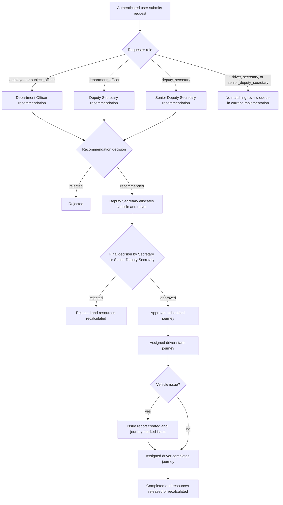
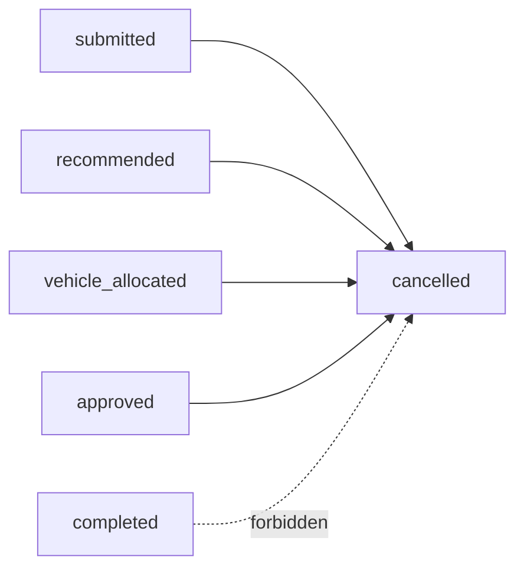

# Role-Dependent Vehicle Request Workflow

**System:** VMS-GOV Vehicle Management System

**Scope:** Request creation, role-selected recommendation, allocation, final decision, driver execution, cancellation, issue reporting, and workflow notifications

**Implementation basis:** Laravel routes/controllers/models and React API/page consumers as of 2 September 2026

## 1. Workflow summary

The vehicle-request workflow does not send every request through the same chain of reviewers. The first recommendation authority is selected from the requester's persisted role.



The three recommendation paths are alternatives. They are not consecutive stages. Once a valid reviewer recommends a request, it goes directly to deputy allocation.

## 2. Role routing matrix

All authenticated roles can currently call `POST /api/vehicle-requests`, and the SPA exposes the creation page to all seven roles. The backend review queries determine which submissions can progress.

| Requester role | First reviewer selected by notification service | Included in a matching review queue? | Next step after recommendation |
| --- | --- | --- | --- |
| `employee` | Department officer in the same department | Yes | Deputy allocation |
| `subject_officer` | Department officer in the same department | Yes | Deputy allocation |
| `department_officer` | Deputy secretary | Yes | Deputy allocation |
| `deputy_secretary` | Senior deputy secretary | Yes | Deputy allocation |
| `driver` | Department officer in the same department | No; department queue currently excludes drivers | Cannot progress through the normal UI/API queue |
| `secretary` | Department officer in the same department | No; department queue currently excludes secretaries | Cannot progress through the normal UI/API queue |
| `senior_deputy_secretary` | Department officer in the same department | No; department queue currently excludes senior deputies | Cannot progress through the normal UI/API queue |

The unmatched roles are a current implementation gap, not an intended extra workflow branch. Before extending them, decide the required approving authority and update backend queries, notifications, frontend navigation, tests, and durable documentation together.

## 3. Actors and responsibilities

| Actor | Workflow responsibility |
| --- | --- |
| Requester | Supplies trip details, views own request/history, and may cancel an eligible own request |
| Department officer | Reviews eligible `employee` and `subject_officer` requests from the officer's own department |
| Deputy secretary | Reviews `department_officer` requests; allocates/reallocates every recommended request; may cancel a request |
| Senior deputy secretary | Reviews `deputy_secretary` requests; also performs final approval/rejection |
| Secretary | Performs final approval/rejection |
| Driver | Views journeys assigned through the linked driver record; starts/completes them; reports vehicle issues |
| Subject officer | Reads recommended/approved operational queues, manages fleet/driver records, and reviews issue reports |

The user-to-driver link is based on `users.employee_id = drivers.nic`. A driver account without a matching driver directory record cannot execute driver workflow actions.

## 4. End-to-end workflow stages

### 4.1 Stage 1 — Request submission

**Actor:** Any authenticated, active user

**Endpoint:** `POST /api/vehicle-requests`

**Initial database state:**

| Field | Value |
| --- | --- |
| `status` | `submitted` |
| `recommendation_status` | `pending` |
| `journey_status` | `scheduled` by schema default |
| `user_id` | Authenticated user ID |
| `requester_name` | Snapshot of the authenticated user's name |

The client submits location labels and coordinates, but not route distance, duration, or geometry. Laravel validates both points against the Sri Lankan territorial polygon and independently calls the configured OSRM-compatible routing service.

```php
$validated = $request->validate([
    'purpose' => ['required', 'string', 'max:255'],
    'starting_location' => ['required', 'string', 'max:255'],
    'starting_latitude' => ['required', 'numeric', 'between:5.7,10'],
    'starting_longitude' => [
        'required',
        'numeric',
        'between:79.5,82',
        new WithinSriLanka($request->input('starting_latitude')),
    ],
    'destination' => ['required', 'string', 'max:255'],
    'destination_latitude' => ['required', 'numeric', 'between:5.7,10'],
    'destination_longitude' => [
        'required',
        'numeric',
        'between:79.5,82',
        new WithinSriLanka($request->input('destination_latitude')),
    ],
    'departure_at' => ['required', 'date'],
    'expected_return_at' => ['required', 'date', 'after:departure_at'],
    'passenger_count' => ['required', 'integer', 'min:1', 'max:100'],
    'passenger_names' => ['nullable', 'string', 'max:2000'],
    'attachment' => ['nullable', 'file', 'mimes:pdf,jpg,jpeg,png', 'max:5120'],
]);
```

The application treats browser `datetime-local` values as Sri Lankan wall-clock time and converts them to UTC before persistence. Request creation and database notification creation share a transaction. If persistence fails, an uploaded attachment is deleted.

### 4.2 Stage 2A — Department officer recommendation

**Applies to:** `employee` and `subject_officer` requesters

**Authorization:** `role:department_officer`

**Endpoints:**

- `GET /api/department/vehicle-requests?status=pending|history|all`
- `GET /api/department/vehicle-requests/{id}`
- `PATCH /api/department/vehicle-requests/{id}/recommendation`

The queue applies two server-side constraints:

1. The requester must belong to the authenticated officer's department.
2. The requester role must be `employee` or `subject_officer`.

```php
private function departmentRequests(string $department): Builder
{
    return VehicleRequest::query()
        ->whereHas('user', fn (Builder $query) => $query
            ->where('department', $department)
            ->whereIn('role', ['employee', 'subject_officer']));
}
```

A request belonging to another department, or a department officer's own role branch, is concealed with `404` rather than exposed as a forbidden record.

### 4.3 Stage 2B — Deputy secretary recommendation

**Applies to:** `department_officer` requesters

**Authorization:** `role:deputy_secretary`

**Endpoints:**

- `GET /api/approvals/recommendations`
- `PATCH /api/approvals/vehicle-requests/{id}/recommendation`

The queue selects only untouched submissions belonging to department officers:

```php
$requests = VehicleRequest::query()
    ->where('status', 'submitted')
    ->where('recommendation_status', 'pending')
    ->whereHas('user', fn (Builder $user) =>
        $user->where('role', 'department_officer'))
    ->latest()
    ->get();
```

The update endpoint performs the same requester-role check. A deputy cannot use this action to recommend a request from another role branch.

### 4.4 Stage 2C — Senior deputy secretary recommendation

**Applies to:** `deputy_secretary` requesters

**Authorization:** `role:senior_deputy_secretary`

**Endpoints:**

- `GET /api/senior-recommendations/vehicle-requests`
- `GET /api/senior-recommendations/vehicle-requests/{id}`
- `PATCH /api/senior-recommendations/vehicle-requests/{id}`

The queue selects only `submitted` requests with a `pending` recommendation whose requester has the `deputy_secretary` role.

### 4.5 Shared recommendation decision

All three reviewer branches call the same internal recommendation method. It allows one decision only:

```php
private function saveRecommendation(
    Request $request,
    VehicleRequest $vehicleRequest,
): JsonResponse {
    if ($vehicleRequest->recommendation_status !== 'pending') {
        return response()->json([
            'success' => false,
            'message' => 'This request has already been reviewed.',
        ], 422);
    }

    $validated = $request->validate([
        'decision' => ['required', 'in:recommended,rejected'],
        'department_priority' => ['nullable', 'in:critical,high,medium,low'],
        'recommendation_notes' => ['nullable', 'string', 'max:2000'],
    ]);

    $vehicleRequest->update([
        'recommendation_status' => $validated['decision'],
        'department_priority' => $validated['department_priority'] ?? null,
        'recommendation_notes' => $validated['recommendation_notes'] ?? null,
        'recommended_by' => $request->user()->id,
        'recommended_at' => now(),
        'status' => $validated['decision'] === 'recommended'
            ? 'recommended'
            : 'rejected',
    ]);
}
```

| Decision | `recommendation_status` | Overall `status` | Result |
| --- | --- | --- | --- |
| Recommend | `recommended` | `recommended` | Enters deputy allocation queue |
| Reject | `rejected` | `rejected` | Terminal rejection path |

### 4.6 Stage 3 — Vehicle and driver allocation

**Actor:** Deputy secretary

**Authorization:** `role:deputy_secretary`

**Endpoint:** `PATCH /api/approvals/vehicle-requests/{id}/allocate`

**Required:** `vehicle_id`, `driver_id`, `parking_location`

Allocation is not approval. It changes the overall request status from `recommended` to `vehicle_allocated`, after which a secretary or senior deputy secretary must still make the final decision.

Inside a database transaction, the backend locks the chosen vehicle and driver and checks:

- request status is exactly `recommended`;
- vehicle and driver records exist;
- vehicle is `available` or `scheduled_trip`;
- driver is active;
- time intervals do not conflict;
- total passengers fit the vehicle seat capacity;
- overlapping consolidated journeys use the same vehicle/driver pair.

```php
DB::transaction(function () use ($request, $validated, $vehicleRequest): void {
    $vehicle = Vehicle::query()
        ->lockForUpdate()
        ->findOrFail($validated['vehicle_id']);

    $driver = Driver::query()
        ->lockForUpdate()
        ->findOrFail($validated['driver_id']);

    if ($vehicle->hasScheduleConflict(
        $vehicleRequest->departure_at,
        $vehicleRequest->expected_return_at,
        $vehicleRequest->id,
        $vehicleRequest,
    )) {
        abort(422, 'The selected vehicle has an incompatible journey or insufficient seats during this time slot.');
    }

    $vehicleRequest->update([
        'status' => 'vehicle_allocated',
        'allocated_vehicle_id' => $vehicle->id,
        'allocated_driver_id' => $driver->id,
        'allocated_by' => $request->user()->id,
        'allocated_at' => now(),
        'parking_location' => trim($validated['parking_location']),
    ]);

    $vehicle->update(['status' => 'scheduled_trip']);
    $driver->update(['allocated_vehicle' => $vehicle->registration_number]);
});
```

The overlap predicate uses half-open intervals:

```text
existing departure < proposed return
AND
existing return > proposed departure
```

This permits one journey to begin exactly when another ends.

### 4.7 Optional reallocation

**Actor:** Deputy secretary

**Endpoint:** `PATCH /api/approvals/vehicle-requests/{id}/reallocate`

**Required:** Replacement `vehicle_id`, replacement `driver_id`, and `reason`

Reallocation is permitted only when:

- current status is `vehicle_allocated` or `approved`;
- the journey has not started and is not `ongoing`, `issue`, or `completed`;
- a complete previous allocation exists;
- the driver, vehicle, or both actually change;
- the replacement resources pass the same availability, overlap, capacity, and pairing checks.

It records previous resources, reason, actor, and time. The request returns to `vehicle_allocated`, clears the earlier final approval where applicable, and therefore requires a fresh final decision.

### 4.8 Stage 4 — Final decision

**Actors:** Secretary or senior deputy secretary

**Authorization:** `role:secretary,senior_deputy_secretary`

**Endpoints:**

- `GET /api/final-approvals/vehicle-requests?status=pending|approved|rejected|cancelled|all`
- `GET /api/final-approvals/vehicle-requests/{id}`
- `PATCH /api/final-approvals/vehicle-requests/{id}/approve`
- `PATCH /api/final-approvals/vehicle-requests/{id}/reject`

Only a request with `status = vehicle_allocated` may receive a new final decision.

#### Approval

Approval requires saved vehicle and driver IDs and records:

| Field | New value |
| --- | --- |
| `status` | `approved` |
| `approved_by` | Final approver's user ID |
| `approved_at` | Current UTC timestamp |
| `driver_notified_at` | Current UTC timestamp |
| Driver `current_assignment` | Request, destination, schedule, vehicle, notification time |

The journey's existing `journey_status = scheduled` now becomes operationally visible to the assigned driver.

#### Rejection

Final rejection records `status = rejected`, `rejected_by`, and `rejected_at`. Within a transaction, the system recalculates whether the allocated driver and vehicle are still required by another allocated, scheduled, ongoing, or issue journey before releasing them.

### 4.9 Stage 5 — Driver starts the journey

**Actor:** The assigned driver only

**Authorization:** `role:driver`

**Endpoint:** `PATCH /api/driver/journeys/{id}/status`

**Payload:**

```json
{
  "action": "start"
}
```

The backend verifies that:

- the authenticated user has a linked driver record;
- the request's `allocated_driver_id` matches that driver;
- the overall request status is `approved`;
- every request in the consolidated group has `journey_status = scheduled`.

The transaction marks the complete consolidated group as `ongoing`, records `journey_started_at`, and marks the vehicle `unavailable`.

### 4.10 Optional driver issue report

**Actor:** The assigned driver

**Endpoint:** `POST /api/driver/issue-reports`

```json
{
  "vehicle_request_id": 42,
  "issue_type": "mechanical_issue",
  "details": "Engine temperature warning appeared during the journey."
}
```

Allowed issue types are:

- `vehicle_breakdown`;
- `mechanical_issue`;
- `tyre_issue`;
- `fuel_issue`;
- `accident`;
- `journey_delay`;
- `cannot_complete_journey`;
- `other`.

The request must be assigned to that driver, be finally approved, not be completed, and have an allocated vehicle. The transaction creates an `open` report and changes `journey_status` to `issue`. Subject officers and deputy secretaries can read issue reports.

### 4.11 Stage 6 — Driver completes the journey

**Actor:** The assigned driver

**Endpoint:** `PATCH /api/driver/journeys/{id}/status`

```json
{
  "action": "complete"
}
```

Every request in the consolidated group must currently be `ongoing` or `issue`. Completion atomically sets:

| Field | Value |
| --- | --- |
| Request `status` | `completed` |
| Request `journey_status` | `completed` |
| `journey_completed_at` | Current UTC timestamp |

The driver's allocation is cleared only if no other active journey needs it. The vehicle becomes `unavailable`, `scheduled_trip`, or `available` according to its remaining journeys.

## 5. Cancellation branch

The authenticated request owner or a deputy secretary may call:

```text
PATCH /api/vehicle-requests/{id}/cancel
```

Cancellation is accepted only from `submitted`, `recommended`, `vehicle_allocated`, or `approved`. A completed request or journey cannot be cancelled. Repeating cancellation is idempotent and returns success.



When an allocated request is cancelled, the backend locks and recalculates driver and vehicle state so shared or later assignments are not incorrectly released.

## 6. State transition table

The overall request status and journey status are separate state machines.

### 6.1 Overall request status

| Current status | Action | Required role | Next status |
| --- | --- | --- | --- |
| — | Submit | Any authenticated role | `submitted` |
| `submitted` | Recommend | Role selected from requester branch | `recommended` |
| `submitted` | Reject recommendation | Role selected from requester branch | `rejected` |
| `recommended` | Allocate | Deputy secretary | `vehicle_allocated` |
| `vehicle_allocated` | Final approve | Secretary or senior deputy | `approved` |
| `vehicle_allocated` | Final reject | Secretary or senior deputy | `rejected` |
| `approved` | Reallocate before start | Deputy secretary | `vehicle_allocated` |
| `vehicle_allocated` | Reallocate before start | Deputy secretary | `vehicle_allocated` |
| `approved` | Complete journey | Assigned driver | `completed` |
| Eligible pre-completion state | Cancel | Owner or deputy secretary | `cancelled` |

### 6.2 Journey status

| Current journey status | Action | Required actor | Next journey status |
| --- | --- | --- | --- |
| `scheduled` | Start | Assigned driver | `ongoing` |
| `scheduled` or `ongoing` | Report issue on eligible approved journey | Assigned driver | `issue` |
| `ongoing` | Complete | Assigned driver | `completed` |
| `issue` | Complete | Assigned driver | `completed` |

Although the issue endpoint currently accepts an approved, non-completed journey, normal operational use is to report issues against the active assigned journey.

## 7. Role-based API map

| Role | Read endpoints | Mutation endpoints |
| --- | --- | --- |
| Any authenticated requester | Own `/vehicle-requests` list/detail | Create request, calculate route, reverse geocode, cancel eligible own request |
| Department officer | `/department/vehicle-requests...` for same department and eligible requester roles | Department recommendation/rejection |
| Deputy secretary | `/approvals/...`; department recommendations; vehicles/drivers | Recommend department-officer request; allocate; reallocate; cancel |
| Senior deputy secretary | `/senior-recommendations/...`; `/final-approvals/...`; vehicles/drivers | Recommend deputy request; final approve/reject |
| Secretary | `/final-approvals/...`; vehicles/drivers | Final approve/reject |
| Driver | Own dashboard, schedule, history, and assigned vehicle | Start/complete assigned journey; report issue |
| Subject officer | Recommended requests, approved journeys, issue reports, fleet/driver data | Fleet and driver maintenance, plus own request creation |

Every route is inside `auth:sanctum`. The narrower `role:` middleware is the authoritative role boundary; React `ProtectedRoute` is navigation-only protection.

## 8. Notification flow by event

```mermaid
sequenceDiagram
    participant Actor
    participant API
    participant DB
    participant Notify as WorkflowNotificationService
    participant Recipient

    Actor->>API: Perform workflow action
    API->>DB: Validate and persist transition
    API->>Notify: Dispatch event-specific notification
    Notify->>DB: Store per-user notification
    Notify-->>Recipient: Optional Web Push when configured
    API-->>Actor: JSON success response
```

| Event | Main recipients |
| --- | --- |
| Request submitted | Role-dependent first reviewer |
| Recommended | Requester and deputy allocation users |
| Rejected at recommendation | Requester |
| Allocated/reallocated | Requester, allocated driver, secretary, senior deputy |
| Finally approved/rejected | Requester and allocated driver |
| Cancelled | Requester and allocated driver where present |
| Journey started/completed | Requester |
| Issue reported | Requester, subject officers, deputy secretaries |

Notifications use the database channel and optionally Web Push when stable VAPID keys exist. Payloads contain only non-sensitive titles/messages, internal identifiers, and role-dashboard navigation data.

## 9. Frontend page and API mapping

| Workflow concern | Main frontend route/page | Client API functions |
| --- | --- | --- |
| Create request | `/createvehiclerequest` | `createVehicleRequest`, route/reverse-geocode helpers |
| Own history/detail | `/requesthistory`, `/employee/requests/:id` | `getMyVehicleRequests`, `getMyVehicleRequest`, `cancelMyVehicleRequest` |
| Department review | `/pendingrecommendations`, `/employee/recommendations/:id` | `getDepartmentVehicleRequests`, `getDepartmentVehicleRequest`, `submitRecommendation` |
| Deputy recommendation | `/deputy/pending-recommendations`, `/deputy/recommendations/:id` | `getDeputyPendingRecommendations`, `saveDeputyRecommendation` |
| Senior recommendation | `/senior-deputy/pending-recommendations`, `/senior-deputy/recommendations/:id` | `getSeniorPendingRecommendations`, `getSeniorRecommendationRequest`, `saveSeniorRecommendation` |
| Allocation/reallocation | `/pendingapprovals`, `/approval/:id` | `getApprovalVehicleRequests`, `allocateVehicleRequest`, `reallocateVehicleRequest` |
| Final decision | `/pendingfinalapprovals`, `/final-approvals/:id` | `getFinalApprovalVehicleRequests`, `finalApproveVehicleRequest`, `finalRejectVehicleRequest` |
| Driver execution | `/driverdashboard`, `/tripshistory`, `/reportvehicle` | scheduled journey, status update, assigned vehicle, issue report functions |

Example client transition call:

```jsx
export const saveSeniorRecommendation = async (requestId, recommendation) => {
  const response = await API.patch(
    `/senior-recommendations/vehicle-requests/${requestId}`,
    recommendation,
    {
      headers: {
        Authorization: `Bearer ${localStorage.getItem("token")}`,
      },
    },
  );

  return response.data;
};
```

## 10. Authorization and consistency rules

The workflow depends on these invariants:

1. The authenticated user's persisted role selects the recommendation branch.
2. Department review is isolated by the requester's department on the server.
3. A recommendation can be saved only while `recommendation_status = pending`.
4. Allocation requires `status = recommended`; final review requires `status = vehicle_allocated`.
5. Only the saved assigned driver can start, complete, or report against a journey.
6. Vehicle capacity must cover all passengers sharing a consolidated journey.
7. Allocation, reallocation, cancellation, completion, and issue transitions update related entities transactionally.
8. Row locks protect vehicle/driver selection and release against concurrent actions.
9. Scheduled departure and expected-return timestamps do not change after creation.
10. Audit actor IDs and timestamps are stored for each workflow decision.
11. Operational timestamps are stored in UTC and displayed in the configured local timezone.
12. Backend authorization remains authoritative even if a frontend route or button is visible.

## 11. Error behavior

| Status | Meaning in this workflow |
| --- | --- |
| `401` | Missing or invalid Sanctum authentication |
| `403` | Authenticated user has the wrong role or inactive account |
| `404` | Record does not exist, is not owned/assigned, or visibility is deliberately concealed |
| `422` | Validation failure, already-reviewed request, invalid state transition, unavailable resource, overlap, or capacity failure |
| `500` | Unexpected request creation/persistence failure |

Repeated allocation of an already allocated/approved request, repeated final approval, repeated final rejection, and repeated cancellation have explicit idempotent success behavior where implemented. Other invalid repeated transitions return `422`.

## 12. Source files

The workflow is implemented across:

```text
backend/routes/api.php
backend/app/Http/Controllers/Api/VehicleRequestController.php
backend/app/Http/Controllers/Api/DriverController.php
backend/app/Http/Controllers/Api/VehicleIssueReportController.php
backend/app/Http/Middleware/RoleMiddleware.php
backend/app/Models/VehicleRequest.php
backend/app/Models/Vehicle.php
backend/app/Models/Driver.php
backend/app/Services/WorkflowNotificationService.php
backend/app/Notifications/WorkflowNotification.php
frontend/src/App.jsx
frontend/src/api/authApi.jsx
frontend/src/pages/requests/
frontend/src/pages/recommendations/
frontend/src/pages/deputySecretary/
frontend/src/pages/seniorDeputySecretary/
frontend/src/pages/driver/
backend/tests/Feature/DepartmentOfficerVehicleRequestWorkflowTest.php
backend/tests/Feature/DeputySecretaryVehicleRequestWorkflowTest.php
backend/tests/Feature/VehicleRequestRecommendationTest.php
```

When changing the workflow, update the relevant migrations/models/controllers/routes, API functions, all affected role pages, three-language labels, notifications, tests, `AGENTS.md`, and architecture documentation as one end-to-end contract.
