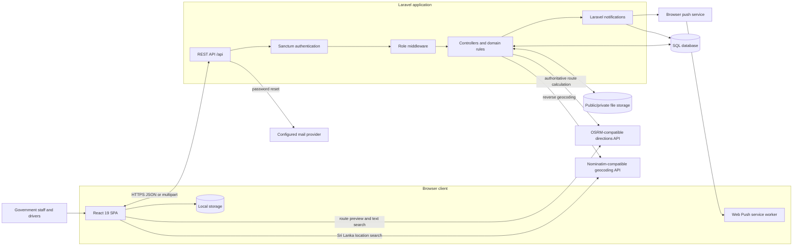
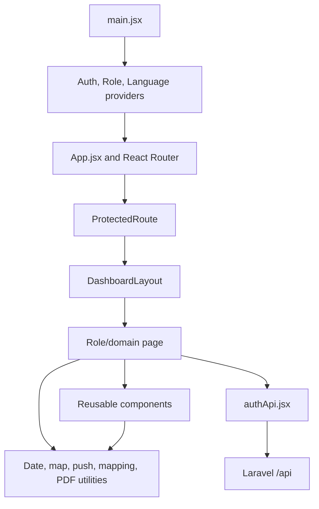
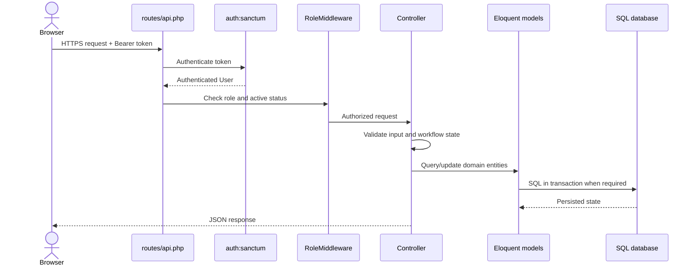
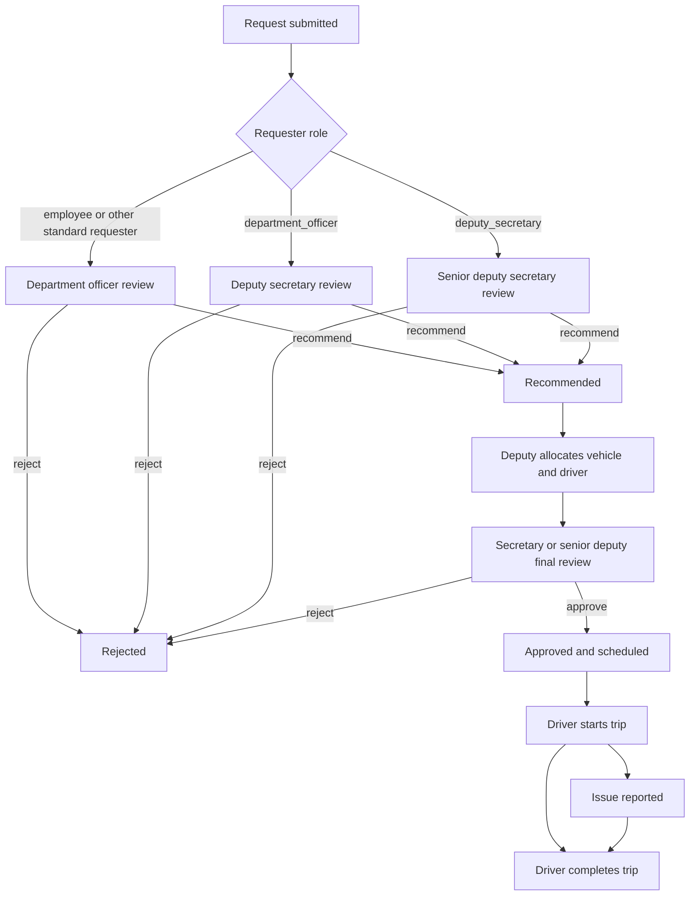
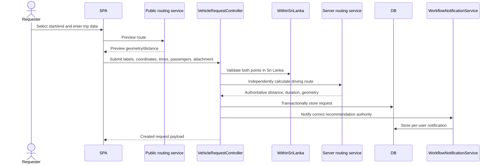
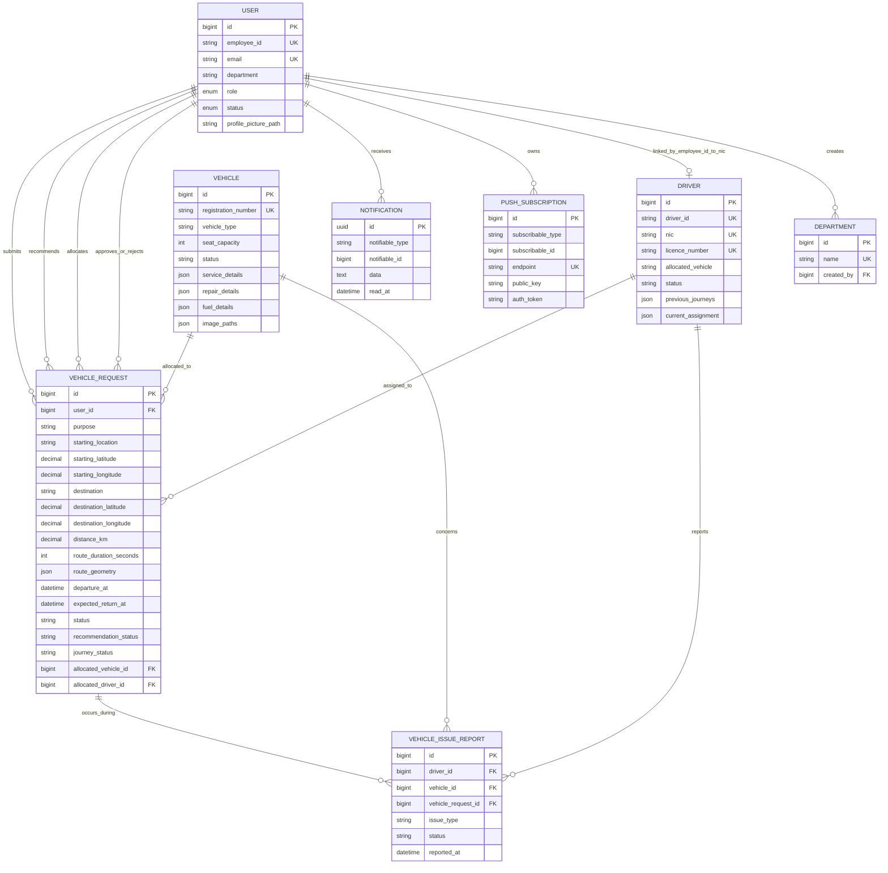
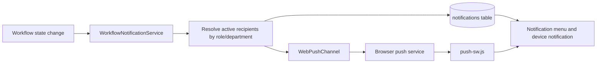
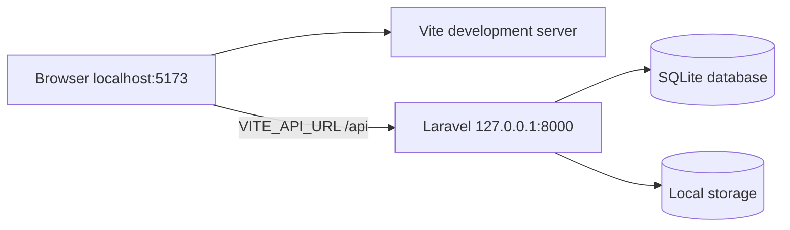
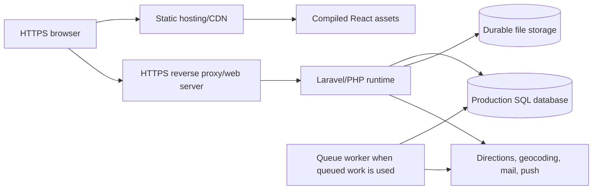

# VMS-GOV Complete System Architecture

**System:** Vehicle Management System for the Chief Ministry, Dakshinapaya, Labuduwa, Galle, Sri Lanka

**Architecture style:** React single-page application backed by a Laravel REST API

**Document basis:** Repository implementation as of 2 September 2026

## 1. Purpose and scope

VMS-GOV replaces the paper-based official-journey process with a role-controlled digital workflow. It combines vehicle requests, recommendations, vehicle and driver allocation, final approval, trip execution, issue reporting, fleet administration, maintenance records, notifications, dashboards, and PDF reporting.

This document describes the implemented architecture. It covers:

- system context and runtime containers;
- frontend and backend components;
- identity, authorization, and role boundaries;
- request, approval, allocation, trip, and notification flows;
- the logical data model and canonical field contract;
- API organization and external integrations;
- storage, deployment, security, testing, and extension points;
- representative code patterns taken from the application.

The executable source remains authoritative. If this document differs from migrations, backend routes/controllers/models/tests, or frontend consumers, follow that source-of-truth order and update this document.

## 2. Architectural overview



The browser is an untrusted client. Client route guards improve navigation, but Laravel authentication, RBAC, validation, ownership checks, state checks, transactions, and row locks form the security and consistency boundary.

## 3. Technology stack

| Layer | Implemented technology | Responsibility |
| --- | --- | --- |
| UI | React 19, React Router 7 | Role-oriented pages and navigation |
| Build and styling | Vite 8, Tailwind CSS 4 | Development server and production SPA bundle |
| Client communication | Axios | JSON and multipart REST requests |
| Client state | React Context, `localStorage` | Authentication, role, language, and theme state |
| UI support | Recharts, Lucide/React Icons, react-hot-toast | Charts, icons, and feedback |
| API | PHP 8.2+, Laravel 12 | Routing, validation, orchestration, serialization |
| Authentication | Laravel Sanctum 4 | Bearer-token creation and validation |
| Persistence | Eloquent ORM | Entities, relationships, casts, and queries |
| Database | SQLite by default; MySQL supported | Transactional application data |
| Notifications | Laravel database notifications and Web Push | In-app and device workflow alerts |
| Files | Laravel filesystem plus public vehicle images | Attachments, profile pictures, and vehicle images |
| Maps | OpenStreetMap UI, OSRM-compatible routing, Nominatim-compatible geocoding | Location selection, route preview/calculation, reverse geocoding |
| Testing | PHPUnit 11 / Laravel feature tests, ESLint, Vite build | Backend behavior and frontend quality checks |

## 4. Repository structure

```text
VMS-GOV/
├── frontend/                         # Production React SPA
│   ├── public/
│   │   ├── push-sw.js                # Background Web Push handler
│   │   └── manifest.webmanifest      # Installable web-app metadata
│   ├── src/
│   │   ├── api/authApi.jsx           # Shared REST client functions
│   │   ├── components/               # Shared and role/domain UI components
│   │   ├── context/                  # Auth, role, and language providers
│   │   ├── i18n/                     # English, Sinhala, and Tamil text
│   │   ├── layouts/                  # Dashboard shell
│   │   ├── pages/                    # Route-level screens
│   │   ├── routes/ProtectedRoute.jsx # Client navigation guard
│   │   ├── utils/                    # Maps, dates, push, mapping, PDF exports
│   │   ├── App.jsx                   # SPA route registry
│   │   └── main.jsx                  # Provider composition and bootstrap
│   └── vercel.json                   # SPA fallback and current API proxy rule
├── backend/                          # Laravel REST API
│   ├── app/
│   │   ├── Http/Controllers/Api/     # Endpoint orchestration
│   │   ├── Http/Middleware/          # Server RBAC
│   │   ├── Http/Requests/Auth/       # Authentication validation objects
│   │   ├── Models/                   # Eloquent domain entities
│   │   ├── Notifications/            # Database/Web Push message format
│   │   ├── Rules/                    # Sri Lanka territorial validation
│   │   └── Services/                 # Workflow notification recipient rules
│   ├── config/                       # DB, CORS, queue, storage, services, push
│   ├── database/
│   │   ├── migrations/               # Canonical schema history
│   │   ├── factories/                # Test data factories
│   │   └── seeders/                  # Development users, vehicles, drivers
│   ├── routes/api.php                # API and authorization map
│   └── tests/Feature/                # Workflow/API regressions
├── .github/workflows/ci.yml          # Current frontend CI
├── AGENTS.md                         # Engineering and domain contract
└── SYSTEM_ARCHITECTURE.md            # This document
```

`backend/resources/js` is Laravel scaffold content and is not the production UI.

## 5. Frontend architecture

### 5.1 Composition

The SPA starts in `frontend/src/main.jsx`. Providers are nested around the route tree:

```jsx
ReactDOM.createRoot(document.getElementById("root")).render(
  <React.StrictMode>
    <LanguageProvider>
      <RoleProvider>
        <AuthProvider>
          <App />
        </AuthProvider>
      </RoleProvider>
    </LanguageProvider>
  </React.StrictMode>,
);
```

The main responsibilities are:

- `AuthProvider`: stores the current user and Sanctum bearer token;
- `RoleProvider`: exposes role-aware behavior and navigation state;
- `LanguageProvider`: supplies English (`en`), Sinhala (`si`), or Tamil (`ta`) content;
- `App.jsx`: registers public and protected browser routes;
- `DashboardLayout`, `Sidebar`, and `Topbar`: provide the shared authenticated shell;
- page components: fetch endpoint data and compose domain-specific components;
- utilities: normalize dates and drivers, render maps, manage push subscriptions, and produce PDFs.

### 5.2 Client authentication and API calls

The current bearer token and serialized user are stored in browser `localStorage`. Axios calls attach the token explicitly:

```jsx
const API = axios.create({
  baseURL: import.meta.env.VITE_API_URL || "http://127.0.0.1:8000/api",
  headers: {
    "Content-Type": "application/json",
    Accept: "application/json",
  },
});

export const getMyVehicleRequests = async () => {
  const response = await API.get("/vehicle-requests", {
    headers: {
      Authorization: `Bearer ${localStorage.getItem("token")}`,
    },
  });

  return response.data;
};
```

Multipart functions override `Content-Type` for request attachments, profile pictures, and vehicle images. API functions preserve Laravel response or validation messages for display through the established toast/UI patterns.

### 5.3 Client route authorization

Sensitive routes should pass an explicit list of roles to `ProtectedRoute`:

```jsx
const withAuth = (element, allowedRoles) => (
  <ProtectedRoute allowedRoles={allowedRoles}>{element}</ProtectedRoute>
);

<Route
  path="/finalapprovals"
  element={withAuth(
    <FinalApprovals />,
    ["secretary", "senior_deputy_secretary"],
  )}
/>
```

The client guard redirects missing sessions and disallowed roles, but it is not an authorization boundary. A user can construct HTTP requests independently of the SPA, so every privileged API route also has backend middleware.

### 5.4 Frontend module flow



### 5.5 Responsive maps and localization

The shared location picker and renderer use the rendered container's dimensions for Web Mercator projection. Editable maps allow location selection inside Sri Lanka; driver maps are read-only. Both support drag/pan, pinch zoom, and wheel/trackpad zoom while preserving OpenStreetMap attribution.

All user-facing changes should be reflected in the three translation dictionaries. Operational dates should go through the shared date/time utilities with `en-LK`, `si-LK`, or `ta-LK`, while backend timestamps remain UTC.

## 6. Backend architecture

### 6.1 Request pipeline



Laravel 12 registers API routing and the `role` alias in `backend/bootstrap/app.php`. CORS is applied normally and is also reapplied to early API exception responses so an allowed SPA origin can read the true error status and body.

### 6.2 Server-side RBAC

The server checks the authenticated role and active account status:

```php
public function handle(Request $request, Closure $next, string ...$roles): Response
{
    $user = $request->user();

    if (! $user) {
        return response()->json([
            'success' => false,
            'message' => 'Unauthenticated.',
        ], 401);
    }

    if (! in_array($user->role, $roles, true)) {
        return response()->json([
            'success' => false,
            'message' => 'You do not have permission to access this resource.',
        ], 403);
    }

    if (! $user->isActive()) {
        return response()->json([
            'success' => false,
            'message' => 'Your account is not active.',
        ], 403);
    }

    return $next($request);
}
```

Route groups keep capabilities narrow. For example, executive roles can read fleet data, while only the subject officer can mutate it:

```php
Route::middleware('role:subject_officer,deputy_secretary,secretary,senior_deputy_secretary')
    ->group(function () {
        Route::get('/vehicles', [VehicleController::class, 'index']);
        Route::get('/drivers', [DriverController::class, 'index']);
    });

Route::middleware('role:subject_officer')->group(function () {
    Route::post('/vehicles', [VehicleController::class, 'store']);
    Route::post('/vehicles/{vehicle:registration_number}', [VehicleController::class, 'update']);
    Route::post('/drivers', [DriverController::class, 'store']);
});
```

### 6.3 Controller and domain responsibilities

| Component | Main responsibility |
| --- | --- |
| `AuthController` | Login, registration, logout, password recovery, profile, password change |
| `UserController` | Deputy-controlled user listing and deletion |
| `DepartmentController` | Department directory and deputy-controlled changes |
| `VehicleRequestController` | Submission, route calculation, review stages, cancellation, allocation, reallocation, final decisions, request lists |
| `VehicleController` | Fleet listing/details and subject-officer vehicle mutation/images |
| `DriverController` | Driver directory, availability, scheduled trips, trip history, journey state transitions |
| `VehicleIssueReportController` | Driver issue creation and authorized review |
| `DashboardStatsController` | Executive aggregates |
| `NotificationController` | Per-user notification listing/read state |
| `PushSubscriptionController` | Current user's browser subscription lifecycle |
| `WorkflowNotificationService` | Role/department recipient selection and workflow message dispatch |
| `WithinSriLanka` | Territorial coordinate validation |

Controllers currently own most transaction orchestration. Eloquent models contain reusable relationships, casts, schedule-conflict checks, consolidated-journey rules, and computed URLs or totals.

### 6.4 Transaction and locking pattern

Allocation is a multi-entity state change. It locks the candidate vehicle and driver, checks availability, schedule overlap, vehicle capacity, and consolidated pairing, then changes all related state atomically:

```php
DB::transaction(function () use ($request, $validated, $vehicleRequest): void {
    $vehicle = Vehicle::query()
        ->lockForUpdate()
        ->findOrFail($validated['vehicle_id']);

    $driver = Driver::query()
        ->lockForUpdate()
        ->findOrFail($validated['driver_id']);

    if ($vehicle->hasScheduleConflict(
        $vehicleRequest->departure_at,
        $vehicleRequest->expected_return_at,
        $vehicleRequest->id,
        $vehicleRequest,
    )) {
        abort(422, 'The selected vehicle has an incompatible journey or insufficient seats during this time slot.');
    }

    if ($driver->hasScheduleConflict(
        $vehicleRequest->departure_at,
        $vehicleRequest->expected_return_at,
        $vehicleRequest->id,
        $vehicleRequest,
    )) {
        abort(422, 'The selected driver has an incompatible journey during this time slot.');
    }

    $vehicleRequest->update([
        'status' => 'vehicle_allocated',
        'allocated_vehicle_id' => $vehicle->id,
        'allocated_driver_id' => $driver->id,
        'allocated_by' => $request->user()->id,
        'allocated_at' => now(),
        'parking_location' => trim($validated['parking_location']),
    ]);

    $vehicle->update(['status' => 'scheduled_trip']);
    $driver->update(['allocated_vehicle' => $vehicle->registration_number]);
});
```

Cancellation, reallocation, trip completion, and issue reporting use the same principle: validate the transition, lock affected records, update related entities together, and retain audit actors and timestamps.

## 7. Roles and capability boundaries

Role values are persisted as exact snake_case strings.

| Role | Request capabilities | Operational/administrative capabilities |
| --- | --- | --- |
| `employee` | Create, view, and cancel eligible own requests | Profile and password |
| `department_officer` | Requester capabilities; review only own department; recommend/reject | Department dashboard/history |
| `subject_officer` | Create own requests; read recommended/approved requests | Sole fleet/driver writer; maintenance, fuel, repair, analytics; issue review |
| `deputy_secretary` | Recommend department-officer requests; allocate/reallocate | User/department administration; executive/fleet reads; issue review |
| `senior_deputy_secretary` | Recommend deputy-secretary requests; final approve/reject | Executive and read-only fleet views |
| `secretary` | Final approve/reject | Executive and read-only fleet views |
| `driver` | Create personal requests | Own schedule/history/vehicle; start/complete trips; report issues |

Backend ownership and department filters are mandatory even where a page is hidden in the SPA.

## 8. Core workflow architecture

### 8.1 Recommendation branches

The recommendation stage depends on the requester's role. These are alternative branches, not three sequential approvals:



### 8.2 Request submission and authoritative routing



The browser never supplies authoritative `distance_km`, `route_duration_seconds`, or `route_geometry`. The server calculates and persists them after validating that both coordinates fall inside the Sri Lankan territorial polygon.

### 8.3 Allocation, final approval, and trip execution

```mermaid
sequenceDiagram
    actor Deputy
    actor FinalApprover as Secretary/Senior Deputy
    actor Driver
    participant API
    participant DB
    participant Notify

    Deputy->>API: Allocate vehicle, driver, parking location
    API->>DB: Lock resources and check overlap/capacity
    API->>DB: status = vehicle_allocated
    API->>Notify: Notify requester, driver, final approvers
    FinalApprover->>API: Approve
    API->>DB: status = approved; journey_status = scheduled
    API->>Notify: Notify requester and driver
    Driver->>API: action = start
    API->>DB: Group journey(s) = ongoing
    API->>Notify: Notify requester
    Driver->>API: action = complete
    API->>DB: Group journey(s) = completed; release/update resources
    API->>Notify: Notify requester
```

Overlapping requests may be consolidated only when they use the same vehicle/driver pair, have not started, and fit the vehicle capacity. Consolidated driver payloads preserve route information per member request rather than constructing a false combined route.

### 8.4 State vocabulary

| Concern | Implemented values |
| --- | --- |
| Overall request status | `submitted`, `recommended`, `vehicle_allocated`, `approved`, `rejected`, `cancelled`, `completed` |
| Recommendation status | `pending`, `recommended`, `rejected` |
| Journey status | `scheduled`, `ongoing`, `issue`, `completed` |
| Vehicle operational status | `available`, `scheduled_trip`, `unavailable`, `maintenance` |
| Driver operational result | `available`, `scheduled_trip`, `ongoing_trip`, `unavailable` |
| User account status | `active`, `inactive`, `suspended` in schema; privileged middleware requires `active` |
| Issue report status | Created as `open` |

The fields represent different dimensions and must not be collapsed into a single UI status alias.

## 9. Data architecture

### 9.1 Logical entity relationship model



`VehicleRequest` also stores previous allocation references and all recommendation, allocation, reallocation, approval, rejection, cancellation, start, and completion actor/timestamp audit fields. The diagram emphasizes the main navigation relationships.

### 9.2 Canonical route field contract

| Meaning | Field |
| --- | --- |
| Start label | `starting_location` |
| Start point | `starting_latitude`, `starting_longitude` |
| End label | `destination` |
| End point | `destination_latitude`, `destination_longitude` |
| Authoritative one-way road distance | `distance_km` |
| Authoritative route duration | `route_duration_seconds` |
| GeoJSON coordinate array | `route_geometry` |

Normal scheduled-journey responses also derive `round_trip_distance_km` as `distance_km * 2`. Missing coordinates remain `null`; consumers must not display them as `0.000000`.

### 9.3 Eloquent relationship and cast example

```php
class VehicleRequest extends Model
{
    protected function casts(): array
    {
        return [
            'distance_km' => 'float',
            'route_duration_seconds' => 'integer',
            'route_geometry' => 'array',
            'departure_at' => 'datetime',
            'expected_return_at' => 'datetime',
            'approved_at' => 'datetime',
        ];
    }

    public function allocatedVehicle(): BelongsTo
    {
        return $this->belongsTo(Vehicle::class, 'allocated_vehicle_id');
    }

    public function allocatedDriver(): BelongsTo
    {
        return $this->belongsTo(Driver::class, 'allocated_driver_id');
    }
}
```

Schema evolution is migration-only. A new persisted field requires aligned migration, fillable/cast/relationship definitions, validation, controller serialization, frontend mapping, tests, seeders/factories where applicable, and documentation.

## 10. API architecture

All listed endpoints are below `/api`. Except login and password recovery, they require `auth:sanctum`.

| Domain | Endpoints | Authorization |
| --- | --- | --- |
| Authentication | `POST /login`, `/forgot-password`, `/reset-password` | Public |
| Session/profile | `POST /logout`, `/logout-all`; `GET/PUT/POST /profile`; `PUT /profile/password` | Authenticated |
| Notifications | `GET /notifications`; `PATCH /notifications/{id}/read`, `/notifications/read-all` | Authenticated owner |
| Push | `GET /push-subscriptions/public-key`; `POST/DELETE /push-subscriptions` | Authenticated owner |
| Users/departments | `POST /register`; `GET /users`; `DELETE /users/{user}`; department writes | Deputy secretary |
| Department directory | `GET /departments` | Authenticated |
| Personal requests | create/list/detail/cancel, route preview, reverse geocode | Authenticated with ownership on records |
| Department review | `/department/vehicle-requests...` | Department officer plus department isolation |
| Deputy workflow | `/approvals/...` recommendation, allocation, reallocation | Deputy secretary |
| Senior recommendation | `/senior-recommendations/vehicle-requests...` | Senior deputy secretary |
| Final approval | `/final-approvals/vehicle-requests...` | Secretary or senior deputy secretary |
| Operational lists | `/approved-journeys`, `/recommended-requests`, `/dashboard/executive-stats` | Route-specific roles |
| Driver operations | `/driver/...` schedule, history, vehicle, status update, issue creation | Driver and linked driver record |
| Issue review | `GET /issue-reports` | Subject officer or deputy secretary |
| Fleet reads | vehicles and drivers | Subject/deputy/secretary/senior deputy |
| Fleet writes | vehicle `POST`; driver `POST/PUT/DELETE` | Subject officer |

Public lookup keys are significant: vehicle routes bind by `registration_number`, driver routes bind by `driver_id`, and `/vehicles/id/{vehicle}` explicitly accepts the numeric vehicle key. Vehicle updates use `POST` to support PHP multipart parsing.

The usual response envelope is:

```json
{
  "success": true,
  "message": "Vehicle allocated and request sent for final approval.",
  "data": {
    "vehicle_request": {}
  }
}
```

Expected errors are `401` unauthenticated, `403` forbidden/inactive, `404` missing or deliberately concealed, and `422` validation or invalid workflow transition.

## 11. Notifications and background browser behavior

Workflow events create a per-user Laravel database notification. If stable VAPID keys and a browser subscription exist, the same non-sensitive payload is sent over Web Push.



The service chooses recipients for submission, recommendation/rejection, allocation/reallocation, final decisions, cancellation, trip start/completion, and issue reports. Payloads contain a title, message, internal request identifiers, and a role-dashboard path; they must not contain sensitive personal data.

The SPA notification menu refreshes on open and every minute. The service worker can display notifications when the SPA is closed. Web Push requires HTTPS in production; iOS/iPadOS users must install the site to the Home Screen.

## 12. File and media architecture

| Content | Storage behavior |
| --- | --- |
| Vehicle-request attachment | Validated PDF/JPG/JPEG/PNG, maximum 5 MB, stored through Laravel's public disk |
| Profile picture | Multipart upload; path persisted on `users` |
| Vehicle images | Subject-officer multipart upload; public paths persisted on `vehicles` |
| Generated reports | Created in the browser by domain-specific PDF utilities |

Uploads are untrusted input. MIME type, size, path, authorization, and deletion behavior must be validated on the server. Vehicle-image deletion updates the stored path list and deletes the corresponding public file only when the vehicle update is saved.

## 13. External service boundaries

### 13.1 Directions

- Frontend preview base: `VITE_DIRECTIONS_API_URL`.
- Backend authoritative base: `DIRECTIONS_API_URL`.
- Backend profile: `DIRECTIONS_PROFILE`, default `driving`.
- Backend timeout: `DIRECTIONS_TIMEOUT`, default 15 seconds.
- Default compatible service: public OSRM endpoint.

### 13.2 Geocoding

- Frontend search: `VITE_GEOCODING_API_URL`, restricted to `countrycodes=lk`.
- Backend reverse lookup: `GEOCODING_REVERSE_API_URL`.
- Backend identity: `GEOCODING_USER_AGENT`.
- Backend timeout: `GEOCODING_TIMEOUT`.
- Default compatible service: OpenStreetMap Nominatim.

Public providers require attribution and responsible request rates. Production deployments should configure an identifying user agent and should not implement per-keystroke requests that violate provider policies.

### 13.3 Mail and Google OAuth

Laravel mail settings support password-reset delivery. `VITE_GOOGLE_CLIENT_ID` is supplied to `GoogleOAuthProvider`; like all `VITE_*` values, it is public bundle configuration and must not be treated as a secret. The implemented API's canonical authentication session remains Sanctum bearer-token based.

## 14. Security architecture

The main controls are:

1. Sanctum authenticates protected API requests.
2. `RoleMiddleware` enforces allowed roles and active account state.
3. Controllers enforce record ownership, department isolation, and workflow eligibility.
4. Laravel validation constrains fields, files, foreign keys, times, and territorial coordinates.
5. Transactions and `lockForUpdate()` protect shared vehicle/driver allocation state.
6. Eloquent hides passwords and remember tokens from JSON.
7. CORS permits configured frontend origins and preserves readable API error responses.
8. Uploaded content is validated and stored under controlled paths.
9. Notification payloads avoid sensitive personal data.
10. Operational timestamps are stored in UTC and localized only at system boundaries.

Current architectural risks to account for:

- bearer tokens in `localStorage` make XSS prevention especially important;
- client-only route guards are incomplete on some existing pages and cannot replace backend RBAC;
- public routing/geocoding services create availability and rate-limit dependencies;
- stable VAPID keys are required to preserve browser subscriptions;
- production origins and URLs must use HTTPS and match the configured CORS/API values exactly;
- committed deployment infrastructure is not present, so environment hardening remains an operator responsibility.

## 15. Deployment architecture

### 15.1 Local development



Typical startup:

```powershell
# backend/
composer install
Copy-Item .env.example .env
php artisan key:generate
php artisan webpush:vapid
php artisan migrate --seed
php artisan serve

# frontend/
npm ci
npm run dev
```

### 15.2 Production target



The frontend build can be served independently from the API. `frontend/vercel.json` supplies the SPA fallback and currently includes an API proxy rule; deployed environments should use an HTTPS API destination instead of an unsecured numeric host. Laravel locally defaults to SQLite, while MySQL configuration is available. No full production infrastructure-as-code definition is committed.

Required production configuration includes `APP_URL`, `APP_KEY`, `APP_LOCAL_TIMEZONE`, `FRONTEND_URL`, `DB_*`, filesystem settings, mail settings, routing/geocoding endpoints, and VAPID subject/public/private keys. Only the VAPID public key may be exposed to the browser.

## 16. Reliability and consistency

- Request submission and its persistence-dependent notifications are handled transactionally so a notification database failure cannot leave a partial submission.
- Allocation/reallocation locks shared resources before conflict checks and updates.
- Schedule overlap uses the half-open interval rule: existing departure is before the proposed end and existing return is after the proposed start.
- Trip completion recalculates vehicle state and releases the driver's assignment only when no other active journey needs it.
- Reallocation preserves old vehicle/driver references, reason, actor, and time, and requires a new final approval.
- Departure and expected-return timestamps are immutable after creation.
- Driver and vehicle availability is derived from active request state rather than trusting only a cached UI label.
- Route labels, coordinates, distance, duration, and geometry are persisted so operational screens do not depend on a live routing call.

## 17. Testing and delivery architecture

Backend feature tests cover authentication, user management, driver registration, department isolation/recommendation, deputy workflow, request timing, route/geocoding behavior, CORS, notifications, push subscriptions, and vehicle-image deletion.

Run the narrowest relevant test first, followed by broader checks:

```powershell
# backend/
php artisan test --filter=DeputySecretaryVehicleRequestWorkflowTest
composer test
php artisan test
./vendor/bin/pint --test

# frontend/
npm run lint
npm run build
```

Tests use in-memory SQLite by default. GitHub Actions currently installs, lints, and builds the frontend on pushes and pull requests to `main` and `develop`; the backend CI job exists but is commented out.

## 18. Adding a feature safely

A feature should move through every affected layer:

```mermaid
flowchart LR
    MIG[Migration/schema]
    MODEL[Model fields, casts, relationships]
    VALID[Validation and authorization]
    DOMAIN[Transactional controller/domain behavior]
    ROUTE[API route and role middleware]
    CLIENT[Frontend API function]
    UI[Page/component and three locales]
    TEST[Feature tests, lint, build]
    DOC[AGENTS, README, architecture docs]

    MIG --> MODEL --> VALID --> DOMAIN --> ROUTE --> CLIENT --> UI --> TEST --> DOC
```



Not every change needs a migration, but no affected layer should be skipped. Preserve canonical roles, status strings, route-binding keys, response fields, timezone rules, and unrelated working-tree changes.

## 19. Important design decisions

| Decision | Rationale and consequence |
| --- | --- |
| Separate React and Laravel applications | Independent UI/API deployment and clear REST boundary |
| Sanctum bearer tokens | Simple API authentication; requires careful browser token/XSS handling |
| Server-side role middleware | The browser cannot be trusted to enforce access |
| Controller-led orchestration | Fits the current Laravel codebase; services are extracted for shared complexity such as notifications |
| SQL transactions and row locks | Prevent inconsistent allocation and concurrent double booking |
| Server-authoritative route calculation | Prevents clients from falsifying distance or geometry |
| Persisted route geometry | Driver/detail screens remain useful without recalculation |
| JSON maintenance histories | Keeps embedded service/repair/fuel records with a vehicle; future high-volume analytics may justify normalization |
| Database plus Web Push notifications | Provides durable in-app history and optional background delivery |
| Three-language client dictionaries | Keeps language switching immediate; all new labels must be synchronized |
| Browser-side PDF generation | Avoids report endpoints but requires UI/report mappings to remain aligned |

## 20. Known gaps and future architecture considerations

- Tighten explicit `allowedRoles` on existing SPA routes as those pages are touched.
- Enable the backend test and formatting job in CI.
- Replace any production HTTP API proxy destination with a named HTTPS origin.
- Add repeatable production infrastructure/deployment definitions if deployment becomes repository-managed.
- Consider centralizing Axios bearer/error handling with interceptors to reduce repeated API wrapper code.
- Consider normalized maintenance/fuel tables if embedded JSON histories become too large or require complex server-side analytics.
- Consider an explicit queue strategy and `after_commit` behavior before moving notification delivery or other workflow work fully asynchronous.
- Preserve API response compatibility or version the API when external consumers are introduced.

These are considerations, not claims that the corresponding work is already implemented.
