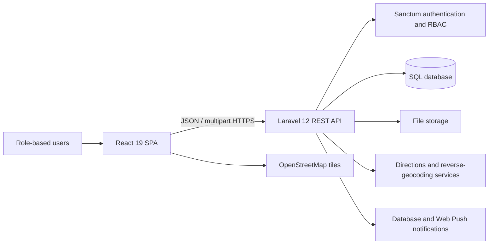
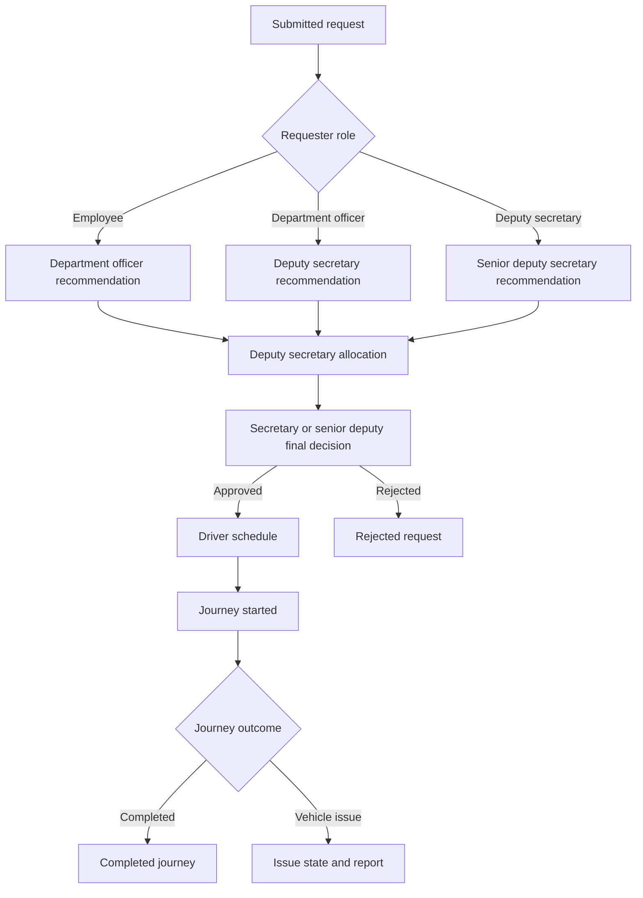
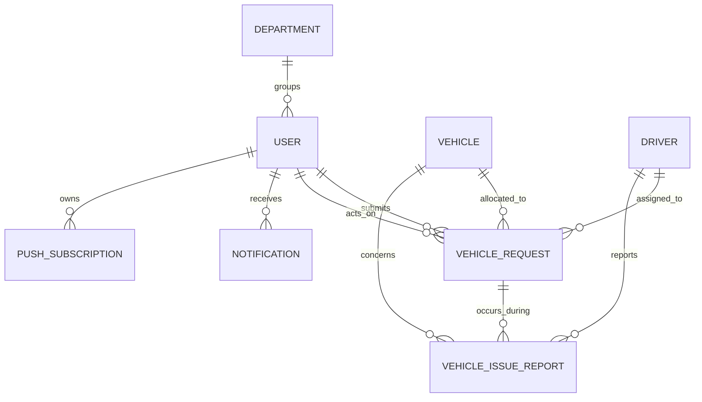

# Vehicle Management System (VMS-GOV)

## University Final Project Report

### Digital Management of Government Vehicle Requests, Fleet Operations, and Official Journeys

**Submitted by:** `[Student name]`  
**Registration number:** `[Registration number]`  
**Degree programme:** `[Degree programme]`  
**Department:** `[Academic department]`  
**University:** `[University name]`  
**Supervisor:** `[Supervisor name]`  
**Academic year:** `[Academic year]`  
**Submission date:** `[Submission date]`

---

## Declaration

I declare that this report describes my individual final-year project work on the Vehicle Management System (VMS-GOV). Except where external technologies, documentation, data sources, or libraries are acknowledged, the analysis, planning, design, implementation, testing, documentation, and evaluation presented here are my own work.

This was an individual multidisciplinary project. I performed responsibilities that would normally be distributed among several members of a professional software team. These responsibilities included project management, business analysis, requirements engineering, system analysis, UI/UX design, solution architecture, database design, frontend development, backend development, API integration, quality assurance, security review, deployment preparation, and technical documentation.

**Student signature:** `[Signature]`  
**Date:** `[Date]`

## Acknowledgements

`[Add acknowledgements for the project supervisor, academic staff, Chief Ministry representatives, intended users, family, colleagues, and any other contributors. Do not list a person without their permission.]`

## Abstract

Government vehicle requests involve several participants, approval stages, physical assets, scheduling constraints, and auditable decisions. A paper-based process can make requests difficult to trace, delay approvals, permit conflicting allocations, and separate journey records from vehicle, driver, fuel, service, repair, and issue information. This project designed and implemented VMS-GOV, a web-based Vehicle Management System for the Chief Ministry at Dakshinapaya, Labuduwa, Galle, Sri Lanka.

VMS-GOV provides a role-based workflow for seven user categories: employee, department officer, subject officer, deputy secretary, senior deputy secretary, secretary, and driver. It supports official vehicle requests, role-dependent recommendations, vehicle and driver allocation or reallocation, final decisions, driver trip operations, issue reporting, fleet administration, maintenance and fuel records, notifications, dashboards, localization, and PDF reports. The solution uses a React single-page application, a Laravel REST API, Laravel Sanctum authentication, server-side role-based access control, and a relational database. Map-based requests use Sri Lanka-restricted location selection and server-calculated driving-route data.

An iterative and incremental development approach was used. Requirements were derived from the organizational workflow, converted into role permissions and state transitions, implemented across the frontend and backend, and verified using feature tests and manual interface review. The repository contains automated coverage for authentication, administration, request isolation, recommendation, allocation, route handling, time behavior, driver registration, notifications, and other workflow operations.

The project demonstrates that a unified digital workflow can improve traceability, scheduling control, information visibility, and accountability. However, repository completion is not equivalent to production acceptance. Formal user-acceptance testing, security assessment, production infrastructure, performance testing, data migration, monitoring, recovery exercises, and operational training remain important future activities.

**Keywords:** vehicle management, fleet management, workflow automation, role-based access control, React, Laravel, government information system, journey scheduling

## Table of contents

1. Introduction
2. Project context and problem analysis
3. Individual multidisciplinary contribution
4. Project methodology and management
5. Requirements analysis
6. System analysis and design
7. System implementation
8. Testing and quality assurance
9. Security, privacy, and ethical considerations
10. Results and evaluation
11. Challenges and lessons learned
12. Deployment and maintenance considerations
13. Future enhancements
14. Conclusion
15. References
16. Appendices

> When converting this Markdown file to Word or PDF, generate the final table of contents automatically so page numbers match the rendered document.

## List of abbreviations

| Abbreviation | Meaning |
| --- | --- |
| API | Application Programming Interface |
| CI | Continuous Integration |
| CRUD | Create, Read, Update, Delete |
| DBMS | Database Management System |
| HTTP | Hypertext Transfer Protocol |
| JSON | JavaScript Object Notation |
| KPI | Key Performance Indicator |
| OSRM | Open Source Routing Machine |
| PWA | Progressive Web Application |
| QA | Quality Assurance |
| RBAC | Role-Based Access Control |
| REST | Representational State Transfer |
| SPA | Single-Page Application |
| SQL | Structured Query Language |
| UAT | User Acceptance Testing |
| UI | User Interface |
| UX | User Experience |
| VMS-GOV | Vehicle Management System project identifier |

# 1. Introduction

## 1.1 Background

Official transport is a shared organizational resource. A single journey may require a requester, a recommending officer, an allocating officer, a final approving authority, a vehicle, a qualified driver, and operational follow-up. The organization must also preserve vehicle and driver availability, capacity, compliance, maintenance, fuel, and journey records.

When these activities depend primarily on paper forms or disconnected records, users may not know the current status of a request, managers may lack timely information, and fleet staff may need to compare several sources before allocating resources. These conditions increase administrative effort and the possibility of delay, duplication, data inconsistency, or scheduling conflict.

VMS-GOV was developed to digitize this process while retaining the organizational authority structure. It combines the official-journey workflow with supporting fleet and driver functions so that decisions and operations can be managed through a single system.

## 1.2 Project aim

The aim of the project was to design and implement a secure, role-based, multilingual web application that manages official vehicle requests and related fleet operations from submission through journey completion.

## 1.3 Objectives

The project objectives were to:

1. study the existing vehicle-request and approval process;
2. identify stakeholders, roles, information needs, rules, and process weaknesses;
3. model an auditable request lifecycle with clear state transitions;
4. prevent invalid or conflicting vehicle and driver allocations;
5. provide driver schedules and controlled journey actions;
6. centralize vehicle, driver, fuel, service, repair, and issue information;
7. implement secure authentication and server-side authorization;
8. support English, Sinhala, and Tamil interfaces;
9. integrate map-based locations and authoritative route calculations;
10. provide dashboards, notifications, and downloadable PDF reports;
11. verify important workflows using automated feature tests;
12. document the system for development, evaluation, deployment, and future maintenance.

## 1.4 Research and development question

The project was guided by the following question:

> How can a role-based web information system digitize the government vehicle-request process while improving traceability, resource-allocation control, operational visibility, and usability for different organizational roles?

## 1.5 Scope

The implemented scope includes:

- authentication, password recovery, profile management, and user administration;
- seven role-specific experiences and dashboards;
- official vehicle-request submission, attachments, history, details, and cancellation;
- role-dependent recommendation stages;
- vehicle and driver allocation and reallocation;
- final approval and rejection;
- journey schedules, start, completion, and issue reporting for drivers;
- vehicle and driver registers;
- fuel, service, repair, compliance, image, and utilization information;
- workflow notifications and optional Web Push notifications;
- executive statistics and PDF reports;
- English, Sinhala, and Tamil localization;
- Sri Lanka-restricted map selection, reverse geocoding, and route calculation.

The following areas are outside the verified final implementation or require additional organizational work:

- organization-wide production rollout;
- formal UAT sign-off from all user groups;
- migration of all historical paper records;
- independent penetration, accessibility, and privacy assessments;
- production monitoring, service-level agreements, and disaster-recovery evidence;
- native Android or iOS applications;
- verified Excel or CSV reporting beyond the implemented PDF exports.

## 1.6 Significance of the project

The project is significant because it addresses both workflow control and asset management. It does not treat a vehicle request as an isolated form. Instead, it links the request to organizational authority, vehicle capacity and availability, driver availability, schedule overlap, journey status, operational issues, and auditable decisions. This provides a foundation for more reliable daily operations and evidence-based management.

# 2. Project context and problem analysis

## 2.1 Existing-process problems

The initial problem analysis identified the following likely weaknesses in a paper-oriented process:

- requesters have limited visibility of progress;
- forms can be delayed between officers;
- the correct recommendation path may depend on manual interpretation;
- allocation requires manual comparison of vehicles, drivers, capacity, and schedules;
- changes may not preserve a complete decision history;
- drivers may receive incomplete or late journey details;
- issue reports may become separated from the affected journey and vehicle;
- fuel, service, repair, and utilization information may be difficult to consolidate;
- management reports require repetitive manual preparation;
- paper records are difficult to search, filter, aggregate, and back up.

## 2.2 Proposed solution

The proposed solution was a centralized web application with a React frontend and Laravel API. The system would guide users through role-specific workflows, store authoritative records in a relational database, prevent invalid transitions, and expose information according to server-enforced permissions.

## 2.3 Stakeholder analysis

| Stakeholder | Need from the system | Project response |
| --- | --- | --- |
| Employees | Submit requests and understand their status | Personal request form, history, details, and cancellation |
| Department officers | Review only their department's requests | Department-isolated queue and recommendation controls |
| Subject officers | Manage fleet operations | Vehicle, driver, fuel, service, repair, analytics, and issue functions |
| Deputy secretary | Administer users and allocate resources | User/department administration, recommendation, allocation, and reallocation |
| Senior deputy secretary | Review senior-stage requests and give permitted decisions | Senior recommendation and final-decision interfaces |
| Secretary | Make final decisions and monitor operations | Final approval/rejection and executive visibility |
| Drivers | Receive complete assignments and operate journeys | Schedule, assigned vehicle, journey actions, history, and issue reporting |
| Executive management | Obtain reliable operational information | Dashboards, statistics, directories, and PDF reports |
| Technical administrators | Operate and maintain the service | Configuration, migrations, tests, logs, storage, and documented setup |

## 2.4 Feasibility analysis

### Technical feasibility

The system was technically feasible using established open-source web technologies. React supports component-based user interfaces, while Laravel provides routing, validation, database access, authentication integration, notifications, and testing facilities. REST-style JSON APIs allow a clear boundary between presentation and business logic.

### Operational feasibility

The system follows recognizable organizational roles rather than introducing an entirely new authority model. This improves operational fit. Adoption still depends on training, data quality, policy approval, reliable connectivity, and a controlled transition from paper records.

### Economic feasibility

The software stack is primarily open source, reducing software licensing requirements. Nevertheless, total cost includes development time, hosting, database and storage services, domain and HTTPS management, backups, monitoring, email, mapping or routing capacity, training, support, and future maintenance.

### Schedule feasibility

An iterative approach allowed the most important workflow to be implemented first and supporting modules to be added progressively. Production readiness requires a separate schedule for UAT, security, migration, deployment, training, pilot operation, and stabilization.

# 3. Individual multidisciplinary contribution

## 3.1 Nature of the individual project

In a commercial project, specialized professionals usually divide the work. For this final project, I performed the complete lifecycle myself. This provided experience not only in programming but also in deciding what should be built, why it should be built, how it should operate, how quality should be evaluated, and how the completed system should be managed.

## 3.2 Activities performed by role

| Role performed | Activities completed | Main evidence in the project |
| --- | --- | --- |
| Project Manager | Defined scope, phased work, priorities, risks, quality gates, delivery status, and readiness recommendations | Project reports, repository plan, risk and readiness sections, prioritized implementation history |
| Business Analyst | Identified stakeholders, problems, business objectives, workflow rules, data needs, roles, and expected outcomes | Role matrix, workflow definition, requirements, acceptance scenarios |
| Requirements Engineer | Converted organizational needs into functional and nonfunctional requirements and validation rules | API behavior, role permissions, frontend screens, tests, documentation |
| System Analyst | Modelled request states, alternative recommendation paths, ownership boundaries, allocation constraints, and entity interactions | Workflow controllers, state vocabulary, transition rules, data model |
| UI/UX Designer | Designed role-specific navigation, responsive layouts, forms, dashboards, maps, feedback, empty states, and multilingual presentation | React pages/components, shared layout, map picker, translation dictionaries |
| Solution Architect | Selected the SPA/API architecture and defined trust boundaries and integrations | React/Laravel separation, REST API, Sanctum, service configuration |
| Database Designer | Designed entities, relationships, audit fields, statuses, indexes, JSON-backed operational histories, and reversible migrations | Laravel migrations and Eloquent models |
| Frontend Software Engineer | Implemented pages, components, routing, contexts, API calls, responsive styling, charts, maps, notifications, and PDF actions | `frontend/src/` |
| Backend Software Engineer | Implemented authentication, RBAC middleware, controllers, validation, transactions, workflows, notifications, and integrations | `backend/app/`, `backend/routes/api.php` |
| API/Integration Engineer | Integrated frontend and backend contracts, route services, geocoding, OpenStreetMap tiles, Web Push, mail, and file uploads | API client, services configuration, controllers, service worker |
| QA Engineer | Defined positive, negative, authorization, isolation, transition, conflict, and persistence tests | `backend/tests/Feature/`, lint/build commands, regression checks |
| Security Reviewer | Applied backend authorization, active-account enforcement, ownership checks, input validation, upload controls, and secret-handling rules | Middleware, validators, protected routes, engineering guardrails |
| DevOps Practitioner | Prepared environment examples, migration/seed commands, CI workflow, build configuration, and deployment considerations | `.env.example`, CI, Vercel fallback, setup documentation |
| Technical Writer | Maintained README, contributor guidance, field contracts, workflow documentation, and project reports | `README.md`, `AGENTS.md`, report files |
| Maintenance Engineer | Investigated cross-layer defects, preserved backward-compatible fields, added regression tests, and synchronized documentation | Git history, targeted fixes, feature tests, updated contracts |

## 3.3 Reflection on combined roles

Performing all roles improved consistency because requirements, API fields, UI behavior, tests, and documentation could be considered together. It also introduced a risk of personal bias and limited independent review. I addressed this by using explicit contracts, role matrices, status vocabularies, feature tests, validation rules, code-quality tools, and documented limitations. For production use, independent business, security, accessibility, and UAT reviews are still recommended.

# 4. Project methodology and management

## 4.1 Development methodology

The project followed an iterative and incremental approach influenced by Agile practices. Work was divided into functional slices that could be designed, implemented, and tested across the complete stack. A typical iteration followed these steps:

1. identify a business problem or missing workflow;
2. inspect the database, backend, frontend, and existing tests;
3. define the required roles, states, fields, and acceptance rules;
4. implement backend validation and behavior;
5. connect the frontend API and interface;
6. add translations and user feedback;
7. add or update automated tests;
8. run focused and broader checks;
9. review the final changes and update documentation.

This approach reduced the risk of developing a user interface that was not supported by authoritative backend behavior.

## 4.2 Work breakdown structure

| Work package | Representative activities |
| --- | --- |
| Initiation | Problem definition, stakeholders, objectives, feasibility, scope |
| Analysis | Existing workflow, role authority, business rules, entities, use cases |
| Design | Architecture, database, API, navigation, state transitions, UI components |
| Core development | Authentication, profiles, users, departments, role routing |
| Workflow development | Requests, recommendations, allocations, approvals, cancellation |
| Operations development | Driver schedules, journey actions, issues, notifications |
| Fleet development | Vehicles, drivers, fuel, service, repair, images, reports |
| Localization and mapping | Three languages, location search, route preview, territory validation |
| Quality assurance | Feature tests, authorization tests, validation, lint, build, manual review |
| Documentation | README, contributor guide, setup, workflow contracts, final reports |
| Readiness planning | CI, infrastructure, UAT, migration, security, support, deployment risks |

## 4.3 Prioritization

Priority was based on business criticality and dependency order. Authentication and role enforcement were required before sensitive modules. Request creation and recommendations preceded allocation. Allocation preceded final approval and driver scheduling. Fleet and driver data were required before reliable assignment. Reporting, notifications, localization, and interface improvements were then developed around the stable workflow.

## 4.4 Risk management

Important project risks included misunderstood approval authority, inconsistent status values, insecure frontend-only authorization, double booking, invalid journey times, mismatched API fields, external map-service failure, unsafe uploads, incomplete localization, and deployment uncertainty.

Risk responses included server-side RBAC, canonical status values, ownership and department isolation, database transactions, allocation conflict checks, immutable scheduled times, shared field contracts, provider timeouts, coordinate fallbacks, file validation, multilingual dictionaries, tests, and production-readiness documentation.

## 4.5 Configuration and version control

The project was maintained in Git. Source code, migrations, tests, configuration examples, and documentation were versioned. Environment secrets were separated into local `.env` files and should never be committed. Generated build output and vendor dependencies are not treated as source changes unless a release process explicitly requires them.

# 5. Requirements analysis

## 5.1 Functional requirements

| ID | Requirement | Status |
| --- | --- | --- |
| FR-01 | Users shall authenticate using supported identity details and receive an authorized session token. | Implemented |
| FR-02 | Authorized users shall manage their profile and password. | Implemented |
| FR-03 | Deputy secretaries shall administer users and departments. | Implemented |
| FR-04 | Requesters shall create an official vehicle request with purpose, locations, schedule, passengers, and optional attachment. | Implemented |
| FR-05 | The system shall calculate authoritative route data on the server. | Implemented |
| FR-06 | Locations shall be restricted to Sri Lankan territory. | Implemented |
| FR-07 | Requesters shall view only their own personal requests and cancel eligible requests. | Implemented |
| FR-08 | Department officers shall review only requests belonging to their department. | Implemented |
| FR-09 | Recommendation authority shall depend on the requester's role. | Implemented |
| FR-10 | Deputy secretaries shall allocate or reallocate eligible vehicles and drivers. | Implemented |
| FR-11 | Allocation shall reject capacity, availability, or schedule conflicts. | Implemented |
| FR-12 | Final authorities shall approve or reject eligible allocated requests. | Implemented |
| FR-13 | Drivers shall view their schedules and assigned vehicle. | Implemented |
| FR-14 | Drivers shall start and complete eligible journeys. | Implemented |
| FR-15 | Drivers shall report vehicle issues against active journeys. | Implemented |
| FR-16 | Subject officers shall manage vehicle and driver records. | Implemented |
| FR-17 | Authorized roles shall review fleet, fuel, service, repair, issue, and utilization information. | Implemented |
| FR-18 | The system shall create workflow notifications for relevant participants. | Implemented |
| FR-19 | Users shall be able to mark their notifications as read. | Implemented |
| FR-20 | The system shall provide English, Sinhala, and Tamil presentation. | Implemented |
| FR-21 | Authorized users shall generate supported PDF reports. | Implemented |
| FR-22 | Executive roles shall view organization-level statistics and read-only operational data. | Implemented |

## 5.2 Nonfunctional requirements

| ID | Requirement | Design response |
| --- | --- | --- |
| NFR-01 Security | Sensitive APIs must require authentication and narrow role authorization. | Sanctum middleware, role middleware, ownership checks |
| NFR-02 Integrity | Multi-entity transitions must be atomic and prevent double booking. | Transactions, locking/conflict checks, validation |
| NFR-03 Usability | Interfaces must provide loading, empty, success, and validation feedback. | Shared UI patterns, toast messages, form errors |
| NFR-04 Responsiveness | Main workflows must operate on mobile and desktop displays. | Tailwind responsive layouts and measured map containers |
| NFR-05 Localization | UI text must support English, Sinhala, and Tamil. | Language context and translation dictionaries |
| NFR-06 Auditability | Decisions and lifecycle changes must identify actor and time. | Status, actor, timestamp, and history fields |
| NFR-07 Maintainability | Fields and statuses must remain consistent across layers. | Canonical contracts, shared utilities, documented conventions |
| NFR-08 Testability | Important rules must be verifiable using automated tests. | PHPUnit feature tests and factories |
| NFR-09 Compatibility | The application should use standard modern web browsers. | Standards-based React SPA and REST API |
| NFR-10 Reliability | External-service failures should produce controlled errors or fallbacks. | Timeouts, server error handling, coordinate/address fallback |
| NFR-11 Time correctness | Operational times must remain consistent across user roles. | UTC storage and Asia/Colombo boundary conversion |
| NFR-12 Data protection | Sensitive data and credentials must not be unnecessarily exposed. | Validation, authorization, protected configuration, logging rules |

## 5.3 Role and permission model

| Role | Main permissions |
| --- | --- |
| `employee` | Personal requests, status, cancellation, profile |
| `department_officer` | Requester functions plus department review and recommendation |
| `subject_officer` | Fleet and driver management, maintenance, fuel, repair, issues, reports |
| `deputy_secretary` | Administration, recommendation, allocation/reallocation, executive views |
| `senior_deputy_secretary` | Senior recommendation, permitted final decisions, executive read access |
| `secretary` | Final decisions and organization-wide executive read access |
| `driver` | Personal schedule, assigned vehicle, trip operations, issues, personal requests |

## 5.4 Core use-case descriptions

### UC-01: Submit a vehicle request

**Primary actor:** Authenticated requester  
**Preconditions:** The account is active and valid locations and trip details are available.  
**Main flow:** The requester enters purpose, start and destination, times, passenger information, and an optional attachment. The backend validates the data, independently calculates a feasible route, stores the request, and creates notifications.  
**Alternative flows:** Invalid times, outside-country coordinates, missing data, route failure, or upload validation causes a controlled error.  
**Postcondition:** A submitted request with authoritative route information and an audit record exists.

### UC-02: Recommend a request

**Primary actor:** Department officer, deputy secretary, or senior deputy secretary according to the requester role  
**Preconditions:** The request is visible to the actor and is in the correct pending state.  
**Main flow:** The actor reviews the request, records a recommendation, priority, and notes where applicable, and the system notifies the next participants.  
**Alternative flow:** The actor rejects the request or attempts an unauthorized/repeated transition.  
**Postcondition:** The recommendation decision and actor/time audit are stored.

### UC-03: Allocate a vehicle and driver

**Primary actor:** Deputy secretary  
**Preconditions:** The request has the required recommendation.  
**Main flow:** The actor selects an eligible vehicle and driver, records parking information, and confirms allocation. The system checks capacity, availability, and overlapping active journeys before committing the change.  
**Alternative flow:** A conflict or invalid resource causes validation failure.  
**Postcondition:** The allocation is recorded and relevant participants are notified.

### UC-04: Approve and complete a journey

**Primary actors:** Secretary or senior deputy secretary; allocated driver  
**Preconditions:** Allocation is complete and the request is eligible for a final decision.  
**Main flow:** The final authority approves the request. It appears in the driver's schedule. The driver starts and later completes the journey. Vehicle and driver operational states are updated.  
**Alternative flows:** Final rejection, cancellation before the trip, or driver issue reporting.  
**Postcondition:** The journey has a complete operational and decision history.

# 6. System analysis and design

## 6.1 High-level architecture



The browser is responsible for presentation and user interaction. The Laravel API is authoritative for validation, authorization, workflow transitions, route calculation, and persistence. This prevents a user from gaining permission merely by changing frontend state or navigating to a hidden page.

## 6.2 Request workflow design

The recommendation stage has alternative branches rather than a single sequence for every requester.



## 6.3 Data model

The principal entities are:

- **User:** authenticated person, role, department, account status, profile, actor relationships, notifications, and Push subscriptions;
- **Department:** unique organizational department;
- **VehicleRequest:** requester, purpose, locations, coordinates, route data, passengers, schedule, workflow status, recommendation, allocation, decisions, cancellation, journey state, and audit actors;
- **Vehicle:** identification, specification, capacity, fuel configuration, compliance, operational status, allocation, images, service, repair, and fuel history;
- **Driver:** identity, contact, licence, duty status, vehicle allocation, current assignment, and previous journeys;
- **VehicleIssueReport:** reported issue linked to a driver and, where available, the vehicle and journey.



Some relationships, such as department membership, are represented by the implemented schema and application conventions rather than every line in this conceptual diagram.

## 6.4 API design

The API is organized by domain and role:

- public authentication and password-recovery routes;
- authenticated profile and notification routes;
- personal vehicle-request routes;
- department review routes;
- deputy recommendation and allocation routes;
- senior recommendation routes;
- final-decision routes;
- driver operation routes;
- issue-review routes;
- vehicle and driver directory/management routes;
- executive statistics and operational list routes.

Responses generally use a consistent structure containing `success`, `message`, and `data`. HTTP status codes distinguish authentication failure, authorization failure, hidden resources, validation/state errors, and successful operations.

## 6.5 UI and navigation design

The UI uses shared layout components with role-aware sidebars and protected routes. Each role receives only the navigation required for its work. Forms use labels, validation feedback, loading indicators, empty states, and confirmation feedback. Shared utilities provide date/time formatting, driver mapping, PDF export, and Sri Lankan map-boundary behavior.

The map component supports mouse and touch interaction, route rendering, responsive measurement, OpenStreetMap attribution, and read-only driver views. External areas are visually shaded, and editable selection is rejected outside the Sri Lankan boundary.

# 7. System implementation

## 7.1 Technology stack

| Layer | Technologies |
| --- | --- |
| Frontend | React 19, React Router 7, Vite 8, Tailwind CSS 4 |
| Client communication | Axios and REST-style JSON/multipart requests |
| UI support | Lucide/React Icons, Recharts, react-hot-toast |
| Backend | PHP 8.2+, Laravel 12 |
| Authentication | Laravel Sanctum bearer tokens |
| Persistence | Eloquent ORM with SQLite for local/test and configurable MySQL support |
| Notifications | Laravel database notifications and Web Push channel |
| Testing and formatting | PHPUnit 11, Laravel feature tests, Laravel Pint, ESLint, Vite build |
| Mapping | OpenStreetMap tiles, Nominatim-compatible search/reverse geocoding, OSRM-compatible routing |

## 7.2 Frontend implementation

The frontend is located in `frontend/`. `App.jsx` defines the route registry, while authentication, role, and language contexts manage shared application state. Page-level components are grouped by domain and role. A centralized API module configures the API base URL and exposes functions used by screens.

Important frontend implementation decisions included:

- maintaining authenticated-user and role state through context providers;
- declaring allowed roles for sensitive client routes;
- centralizing API calls and server-error handling;
- separating shared layout from role-specific pages;
- using reusable components for maps, approval workspaces, dashboards, and directories;
- preserving canonical backend field names rather than creating UI-only aliases;
- providing translations in all three supported languages;
- deriving display values, such as round-trip distance, without changing authoritative stored data;
- keeping driver maps read-only while allowing pan and zoom.

## 7.3 Backend implementation

The backend is located in `backend/`. API routes are registered in `routes/api.php` and protected using Sanctum plus role middleware. Controllers handle validation, authorization, queries, transactions, workflow changes, file operations, external-service calls, and JSON responses. Eloquent models define fillable fields, casts, and relationships. Migrations preserve the schema history.

Important backend decisions included:

- enforcing permissions on the server rather than trusting frontend visibility;
- rejecting inactive accounts in privileged middleware;
- filtering personal and departmental records in backend queries;
- validating lifecycle state before each transition;
- using transactions for operations that affect multiple records;
- checking vehicle capacity and overlapping resource schedules;
- recording decision actors and timestamps;
- keeping scheduled departure and return times immutable after creation;
- computing route data independently instead of trusting the browser preview;
- rolling back request creation when required notification persistence fails;
- preserving previous vehicle/driver data when reallocating.

## 7.4 Database implementation

Schema changes were implemented through reversible Laravel migrations. The schema evolved to include recommendation fields, vehicles, drivers, seat capacity, service history, final approvals, driver journey states, UTC time normalization, cancellation, rejection, reallocation, departments, parking location, vehicle images, profile pictures, fuel efficiency, route fields, notifications, and Push subscriptions.

JSON casts are used where flexible historical arrays are appropriate, including vehicle service, repair, fuel, and image data. Relational fields are used for core identities, requests, actors, vehicles, drivers, and issue reports.

## 7.5 Authentication and authorization

Login returns a Sanctum token used by the SPA when calling protected endpoints. Route middleware confirms authentication. Custom role middleware checks both the required role and active-account status. Controller queries then enforce ownership, department boundaries, and state-specific visibility.

The frontend route guard improves usability by preventing inappropriate navigation, but it is not treated as the security boundary. This distinction was important because client code can be inspected or modified by a user.

## 7.6 Mapping and routing

The request form supports text search restricted to Sri Lanka and deliberate point selection on a map. The browser may preview a route, but it sends only the selected labels and coordinates when creating the request. The server calls the configured directions service and stores the authoritative distance, duration, and GeoJSON coordinate array.

Territorial validation uses a local Sri Lankan boundary representation in both the frontend and backend. This improves feedback for normal users and also prevents a crafted API request from bypassing the client restriction.

## 7.7 Notifications

Workflow notifications are stored in the database for the recipient. Users can view unread messages and mark individual or all notifications as read. Where browser permission, service-worker support, HTTPS, VAPID keys, and a valid subscription are available, the same workflow can also produce a device notification.

Notification payloads are intentionally limited to operational title/message content, internal identifiers, and a role-dashboard path. Expired subscriptions can be removed by the notification channel.

## 7.8 Reporting

The project contains PDF helpers for fleet directories, vehicle details, approved journeys, fuel, service, repair, and driver issue information. Executive dashboards provide operational statistics. Report values and filenames are part of the acceptance scope because a visually correct report can still be incorrect if its data mapping is wrong.

# 8. Testing and quality assurance

## 8.1 Test strategy

Testing concentrated on high-risk business rules rather than only checking that pages render. The strategy included:

- happy-path workflow tests;
- validation failures;
- unauthenticated and wrong-role access;
- inactive-account behavior;
- ownership and department isolation;
- invalid or repeated state transitions;
- allocation overlap and capacity checks;
- database side effects and audit values;
- API response fields used by the frontend;
- timezone and immutable-time behavior;
- failure handling for external services and notifications.

## 8.2 Automated test evidence

At the report snapshot, the repository contained 12 backend feature-test files and approximately 50 test methods. Tests use an isolated in-memory SQLite database where configured, model factories, and Laravel's HTTP-testing utilities.

Representative tested areas include:

| Test area | Examples of behavior verified |
| --- | --- |
| Authentication | Employee-ID login, invalid credentials, user retrieval |
| User management | Registration authority, validation, listing, deletion |
| Driver registration | CRUD behavior, route fields, schedule responses |
| Department workflow | Department isolation, recommendation authority, state validation |
| Deputy workflow | Recommendation queues, allocation, reallocation, conflicts |
| Final workflow | Approval/rejection permissions and state changes |
| Time behavior | UTC conversion and scheduled-time immutability |
| Mapping | Route calculation, reverse geocoding, Sri Lankan territorial validation |
| Notifications | Persistence, recipient behavior, rollback on failure |
| Fleet operations | Vehicles, drivers, operational status, images or histories where covered |

## 8.3 Quality commands

```bash
# Backend
composer test
php artisan test
./vendor/bin/pint --test

# Frontend
npm run lint
npm run build
```

GitHub Actions currently performs frontend dependency installation, linting, and production build checks for relevant branches. A backend CI job is present but disabled; enabling it is a recommended production-readiness improvement.

## 8.4 Example acceptance-test matrix

| Test ID | Scenario | Expected result |
| --- | --- | --- |
| AT-01 | Employee submits a valid request | Request stored with submitted state and authoritative route data |
| AT-02 | User selects a point outside Sri Lanka | UI rejects selection and API returns validation error |
| AT-03 | Department officer requests another department's record | Access denied or resource concealed according to route design |
| AT-04 | Deputy allocates an undersized vehicle | Validation error; no allocation changes committed |
| AT-05 | Deputy allocates a busy driver | Conflict rejected; existing assignment preserved |
| AT-06 | Final authority approves an eligible request | Approval audit stored; driver schedule updated |
| AT-07 | Driver starts an unassigned journey | Forbidden or invalid-state response |
| AT-08 | Driver completes an active journey | Journey completed and operational resource states updated |
| AT-09 | Notification persistence fails during request creation | Transaction rolls back the request |
| AT-10 | User changes language | Supported interface text changes without altering stored business data |

## 8.5 Limitations of the evaluation

Automated tests provide important evidence but do not prove complete correctness. The project still requires formal usability evaluation, linguistic review, accessibility testing, security assessment, performance testing, browser/device testing, data-volume testing, production recovery exercises, and UAT by real representatives of all seven roles.

# 9. Security, privacy, and ethical considerations

## 9.1 Security controls

Implemented or documented controls include:

- Sanctum-protected API routes;
- narrow role middleware;
- active-account enforcement;
- ownership and department isolation;
- request validation;
- server-controlled state transitions;
- password hashing and password-reset workflows;
- transactional allocation and journey operations;
- upload type, size, path, and authorization checks;
- avoidance of sensitive data in notification payloads;
- rules against logging passwords, tokens, NICs, and unnecessary personal data;
- separation of environment secrets from source code.

## 9.2 Privacy considerations

The system processes names, employee identifiers, departments, contact information, driver identity and licence information, passenger names, journey locations, schedules, profile pictures, and potentially attached documents. These data should be collected only for an approved operational purpose and accessed only by authorized roles.

Before production use, the organization should approve data classification, lawful purpose, retention periods, access-review frequency, backup retention, deletion procedures, report distribution rules, and incident-response obligations. Sample or seeded data must not be treated as production data.

## 9.3 Ethical considerations

Digital traceability improves accountability, but detailed movement and identity records can also create privacy risks. The system should not be used for unrelated employee surveillance. Reports and dashboards should expose only the minimum information required for the recipient's official duty. Users should be informed about what information is collected, why it is collected, who can see it, and how long it is retained.

## 9.4 External-service considerations

Map tiles, search, reverse geocoding, routing, email, and Web Push may depend on external providers. Production use must respect attribution, usage limits, acceptable-use policies, availability constraints, and privacy implications. A public community service should not be assumed to provide a guaranteed organizational service level.

# 10. Results and evaluation

## 10.1 Functional result

The project produced an integrated web application that represents the complete intended request-to-journey process. The main outcome is not a collection of independent CRUD pages; it is a coordinated workflow in which each role receives appropriate actions and the system protects the next state.

The implementation demonstrates:

- differentiated authority for seven roles;
- personal and departmental data isolation;
- controlled recommendation, allocation, decision, and journey transitions;
- schedule and capacity conflict prevention;
- traceable actor and timestamp fields;
- linked vehicle, driver, route, issue, maintenance, fuel, and repair data;
- multilingual and responsive presentation;
- operational notifications and reports;
- automated regression testing of important business behavior.

## 10.2 Evaluation against objectives

| Objective | Evaluation |
| --- | --- |
| Analyze the manual workflow | Achieved through stakeholder, role, state, and business-rule modelling |
| Digitize request processing | Achieved through the request, recommendation, allocation, and decision workflow |
| Prevent resource conflicts | Implemented through capacity, availability, and overlap checks |
| Support driver operations | Implemented through schedules, assigned vehicle, journey actions, history, and issues |
| Centralize fleet information | Implemented through vehicle, driver, fuel, service, repair, image, and issue modules |
| Improve traceability | Implemented through statuses, actors, timestamps, histories, and notifications |
| Support multilingual users | Implemented for English, Sinhala, and Tamil; linguistic UAT remains |
| Provide reports and management views | Implemented through dashboards and PDF exports; business reconciliation remains |
| Verify quality | Substantial feature tests exist; complete nonfunctional and UAT evidence remains |
| Prepare for maintainability | Migrations, conventions, environment examples, and extensive documentation exist |

## 10.3 Expected organizational benefits

The expected benefits are reduced request turnaround time, fewer conflicting allocations, better vehicle and driver utilization, improved record completeness, faster issue visibility, easier report production, and clearer accountability. These are expected rather than experimentally proven benefits because a controlled production pilot and baseline comparison have not yet been completed.

## 10.4 Proposed evaluation metrics

Future pilot evaluation should measure:

- median submission-to-final-decision time;
- recommendation and allocation turnaround;
- number of rejected allocation conflicts;
- percentage of eligible requests completed digitally;
- vehicle utilization and journey completion rates;
- on-time journey starts;
- maintenance compliance;
- fuel-efficiency variance;
- issue resolution time;
- data-quality exceptions;
- user task-completion rate and satisfaction;
- service availability and error rate.

# 11. Challenges and lessons learned

## 11.1 Translating organizational authority into software

The recommendation process was not a simple fixed chain. The responsible recommending role changes according to the requester's role. Modelling these as alternative branches prevented the system from forcing every request through inappropriate stages.

**Lesson:** Business authority must be represented explicitly in states, permissions, and tests rather than inferred from page names.

## 11.2 Maintaining cross-layer data contracts

Location and route data pass through migrations, Eloquent models, controller validation, external services, JSON responses, API functions, maps, details pages, driver schedules, and tests. A mismatch in one layer can appear as a frontend problem even when the cause is upstream.

**Lesson:** Canonical fields and end-to-end contract reviews are essential in a separated frontend/backend architecture.

## 11.3 Scheduling and concurrency

A simple availability flag cannot safely prevent double booking because two journeys may overlap or simultaneous operations may inspect stale state.

**Lesson:** Resource allocation requires time-range conflict checks, transactions, and careful state updates rather than UI filtering alone.

## 11.4 Timezone correctness

Journey timestamps must remain consistent for requesters, approvers, drivers, database records, and tests. Incorrect conversion can change the approved schedule.

**Lesson:** Operational timestamps should be stored in UTC, converted only at boundaries, and protected from mutation after request creation.

## 11.5 Responsive map interaction

Using fixed desktop dimensions for a responsive map can misalign tiles, paths, and markers on smaller screens. Touch gestures can also conflict with browser scrolling and zoom behavior.

**Lesson:** Map projection must use the actual rendered container size and explicitly manage pointer/touch interaction.

## 11.6 Individual-project workload

Performing all professional roles provided broad learning but increased context switching and reduced independent review.

**Lesson:** Written requirements, automated tests, checklists, consistent conventions, and honest limitation reporting are especially important in an individual project.

# 12. Deployment and maintenance considerations

## 12.1 Local operation

The backend requires PHP, Composer, environment configuration, an application key, database migrations, and seeded data where appropriate. The frontend requires Node.js and npm. Development servers normally run separately and communicate through the configured API URL and CORS origin.

## 12.2 Production readiness requirements

Before production rollout, the following should be completed:

- production hosting architecture and ownership;
- repeatable frontend and backend deployment;
- HTTPS, domain, API base URL, and exact CORS configuration;
- protected database, storage, and environment secrets;
- stable VAPID keys and verified Web Push configuration;
- mail, queue, cache, session, geocoding, routing, and file-storage validation;
- database backup, restore, retention, and recovery objectives;
- application, database, infrastructure, and dependency monitoring;
- security, privacy, performance, accessibility, and UAT approval;
- data migration, cleansing, reconciliation, and cutover procedures;
- training, support ownership, incident response, rollback, and hypercare.

## 12.3 Maintenance strategy

Future maintainers should preserve the source-of-truth order: database migrations, backend behavior/tests, frontend consumers, and documentation. Schema changes should use new reversible migrations. Sensitive routes must remain protected by backend middleware. Lifecycle changes must update all affected queues, dashboards, filters, notifications, reports, and tests.

# 13. Future enhancements

Future work may include:

1. enabling backend tests and formatting as mandatory CI checks;
2. expanding automated frontend component and end-to-end tests;
3. completing formal accessibility conformance work;
4. adding an approved production monitoring and incident-management solution;
5. implementing controlled import tools for legacy vehicle, driver, and journey records;
6. adding organization-approved CSV or spreadsheet exports where required;
7. improving maintenance forecasting and fuel-anomaly detection after sufficient trusted data exists;
8. adding configurable service-level and escalation timers;
9. improving report scheduling and executive KPI trend analysis;
10. evaluating a dedicated organizational map/routing service with an appropriate service level;
11. evaluating stronger browser-session token protection as part of the security review;
12. conducting a measured pilot and using evidence to prioritize the post-launch backlog.

# 14. Conclusion

VMS-GOV demonstrates the design and implementation of a substantial role-based government information system. The project transformed a paper-oriented vehicle-request concept into an integrated digital workflow covering requests, authority, allocation, journeys, fleet records, drivers, maintenance, fuel, issues, notifications, maps, localization, dashboards, and reports.

The project also demonstrates multidisciplinary final-project competence. I performed project-management, analysis, design, engineering, testing, security, deployment-preparation, and documentation activities rather than limiting the work to source-code implementation. This made it possible to connect the organizational problem to the implemented technical controls and to evaluate the difference between functional completion and production readiness.

The main project objective was achieved at the functional-system level. The next step is not to claim that deployment risk has disappeared. It is to complete independent review, UAT, infrastructure, migration, performance, recovery, and operational-readiness activities through a controlled pilot. With those measures, VMS-GOV can provide a strong foundation for more efficient, visible, and accountable government fleet operations.

# 15. References

1. Laravel. *Laravel 12.x Documentation: Authentication*. <https://laravel.com/docs/12.x/authentication>
2. Laravel. *Laravel 12.x Documentation: Authorization*. <https://laravel.com/docs/12.x/authorization>
3. Laravel. *Laravel 12.x Documentation: Validation*. <https://laravel.com/docs/12.x/validation>
4. Laravel. *Laravel Sanctum Documentation*. <https://laravel.com/docs/12.x/sanctum>
5. Laravel. *Laravel 12.x Testing Documentation*. <https://laravel.com/docs/12.x/testing>
6. React. *React Documentation: Quick Start*. <https://react.dev/learn>
7. React. *React Documentation: Managing State*. <https://react.dev/learn/managing-state>
8. Vite. *Vite Documentation*. <https://vite.dev/guide/>
9. Tailwind CSS. *Tailwind CSS Documentation*. <https://tailwindcss.com/docs>
10. OWASP Foundation. *Access Control*. <https://owasp.org/www-community/Access_Control>
11. OpenStreetMap Foundation. *Tile Usage Policy*. <https://operations.osmfoundation.org/policies/tiles/>
12. OpenStreetMap Foundation. *Nominatim Usage Policy*. <https://operations.osmfoundation.org/policies/nominatim/>
13. Project OSRM. *OSRM HTTP API Documentation*. <https://project-osrm.org/docs/v5.24.0/api/>
14. geoBoundaries. *geoBoundaries API*. <https://www.geoboundaries.org/api.html>
15. VMS-GOV repository. `README.md`, `AGENTS.md`, source code, migrations, API routes, and automated tests, accessed for this report on 1 September 2026.

> Adapt these references to the citation style required by the university, such as Harvard, IEEE, or APA. Add access dates if required by departmental guidelines.

# 16. Appendices

## Appendix A — Repository structure

```text
VMS-GOV/
├── AGENTS.md
├── README.md
├── PROJECT_MANAGEMENT_REPORT.md
├── UNIVERSITY_FINAL_PROJECT_REPORT.md
├── frontend/
│   ├── public/
│   ├── src/
│   │   ├── api/
│   │   ├── components/
│   │   ├── context/
│   │   ├── i18n/
│   │   ├── pages/
│   │   └── utils/
│   └── package.json
└── backend/
    ├── app/
    │   ├── Http/Controllers/Api/
    │   ├── Http/Middleware/
    │   ├── Models/
    │   └── Rules/
    ├── database/
    │   ├── migrations/
    │   ├── factories/
    │   └── seeders/
    ├── routes/api.php
    └── tests/Feature/
```

## Appendix B — Suggested evidence to add before submission

- `[Screenshot: login page]`
- `[Screenshot: employee dashboard and request form]`
- `[Screenshot: Sri Lanka-restricted map and route preview]`
- `[Screenshot: department recommendation queue]`
- `[Screenshot: deputy allocation workspace]`
- `[Screenshot: final approval page]`
- `[Screenshot: driver schedule and route]`
- `[Screenshot: vehicle and driver management]`
- `[Screenshot: fuel/service/repair view]`
- `[Screenshot: notification menu]`
- `[Screenshot: English, Sinhala, and Tamil interfaces]`
- `[Screenshot: representative PDF report]`
- `[Evidence: test execution output]`
- `[Evidence: frontend lint and production build output]`
- `[Evidence: database schema or ER diagram exported from the final schema]`
- `[Evidence: supervisor-approved requirements or interview notes, with sensitive information removed]`

## Appendix C — Suggested oral-presentation structure

1. Organizational problem and motivation
2. Stakeholders and existing workflow
3. Project aim, objectives, and scope
4. Individual roles and methodology
5. Architecture and technology choices
6. Request workflow demonstration
7. Fleet and driver demonstration
8. Security and data-integrity controls
9. Testing evidence
10. Challenges and lessons learned
11. Limitations, future work, and conclusion

## Appendix D — Final submission checklist

- [ ] Replace all bracketed title-page placeholders.
- [ ] Add supervisor-approved acknowledgements.
- [ ] Confirm the university declaration wording.
- [ ] Apply the required citation style.
- [ ] Add numbered figures, screenshots, captions, and source acknowledgements.
- [ ] Add a generated table of contents, list of figures, and page numbers in the final rendered document.
- [ ] Update test counts and implementation claims if the repository changes.
- [ ] Include actual test/build evidence.
- [ ] Proofread English, Sinhala, and Tamil examples used in figures.
- [ ] Remove development credentials, personal data, and sensitive screenshots.
- [ ] Confirm formatting, word-count, binding, and submission requirements with the department.
- [ ] Export to PDF and inspect every page before submission.
